# FemtoMega Multi-Device Synchronization Example 

<center class="half">
    
    
</center>

# 1. Project Background
In the fields of medical science, sports science, and ergonomics, dynamic 3D human body reconstruction technology is gradually becoming a key force in promoting the progress of teaching and research. This technology captures and reconstructs the three-dimensional data of human motion with precision, providing researchers with a new perspective to understand and analyze human structure and function. The broader commercial application of this technology is in volumetric video (also known as volume video), which captures and reconstructs the human body and objects in three-dimensional space to create holographic images that can be freely observed and interacted with in virtual space. The core of this technology is its ability to record the volume information of the human body and objects in space in real-time, allowing video content to break free from the two-dimensional plane and be displayed freely in three-dimensional space, providing users with a comprehensive perspective and depth perception.This solution is based on the real-time dynamic human body 3D reconstruction system developed using Orbbec's Femto Mega depth cameras.Hardware components: Consists of an RGBD camera array, data processing server, network transmission system, and supplementary lighting.
Software components: Comprises a synchronized image acquisition module, camera array calibration system, real-time reconstruction module, 3D frame sequence encoding module, decoding module, and rendering display module.
Once the system is built, it will achieve real-time 3D dynamic reconstruction of the human body, generating 3D stream media content composed of 3D frame sequences.
# 2. Hardware Connections
## 2.1  Device Connection Methods
Adopting a Star-Type Connection Method (Professional Synchronization Hub)
Note: Before testing, remove the white casing to expose additional interfaces.
### 2.1.1 Connection Topology Diagram

#### （1）Synchronization Device Connections:
One as the Master Device, Seven as Slave Devices.
#### （2）Synchronization Device Connections:
Network Equipment Connections, a total of 8 RGBD cameras, and 2 switches are used. One switch connects four devices, and each switch's IP needs to be isolated (e.g., 192.168.0.1; 192.168.1.1), and the computer's 4 network card IPs need to correspond to the same subnet as the respective switches (e.g., 192.168.0.201; 192.168.1.202).
## 2.2.  Device List
### 2.2.1 FemtoMega
FemtoMega is an advanced iToF 3D camera jointly developed by Orbbec and Microsoft, serving as an official Microsoft-recommended alternative to the Azure Kinect DK. The FemtoMega depth camera incorporates Microsoft's latest advanced ToF (Time of Flight) sensing technology, offering identical working modes and performance characteristics as the Microsoft Azure Kinect DK depth camera.
### 2.2.2  Synchronization Trigger Line
The master device needs to send a trigger signal to the slave devices using a synchronization trigger line. The synchronization trigger line is depicted in the figure below:

For the Femto Mega synchronization trigger line with an 8-pin socket, here is a typical definition of pin functions, wire colors, and pin order. 


Note: When the device is placed upright, the order of the pins from left to right is 1 to 8.
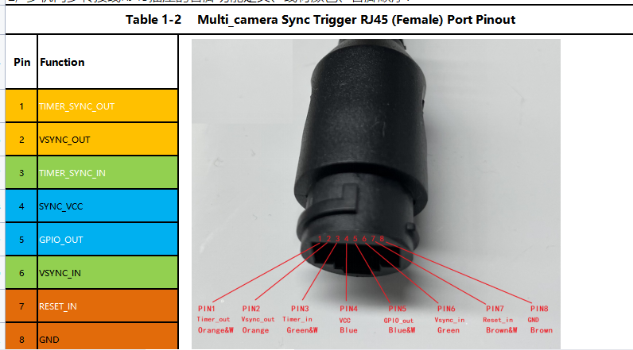
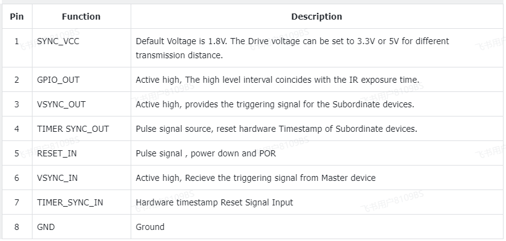
### 2.2.3 Synchronization Hub (Professional Version Hub)
The front view of the multi-machine synchronization Hub is as follows:
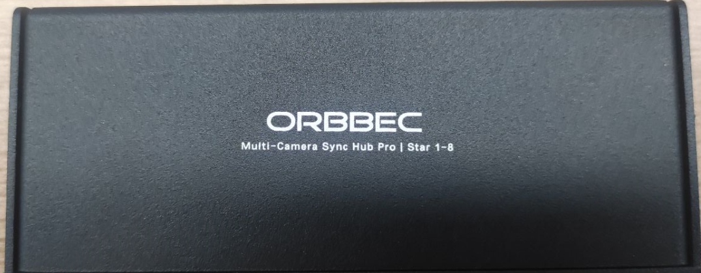
Multi-machine Synchronization Hub's Two Sides Schematic：

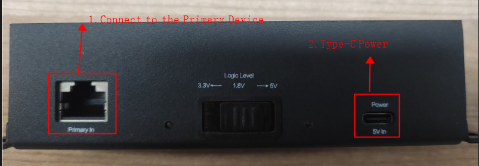

Primary In ： "Indicates connection to the master device."
Power 5v In： " translates to "Indicates that the Hub needs to be powered by a Type-C 5V power supply. (Logic Level is set to 1.8V by default)."


For a star-type connection, a single hub can accommodate up to 8 slave devices. Additionally, by using Hub-to-Hub connections, it is possible to expand the setup into multiple hubs.

_Note: The Ethernet cables used to connect to the multi-machine synchronization Hub must be T568B-T568B cables._

### 2.2.4 Computer Configuration
Current test computer configuration (for reference):
- CPU: 11th Gen i7 / 2.5GHz * 16 cores
- RAM: 32GB
- Graphics: GPU NVIDIA 3060
- Operating System: Ubuntu 22.04
# 3. Hardware Connection Guide
## 3.1 Material Preparation for Connecting Femto Mega via PoE to a Switch
### 3.1.1 Material Preparation
#### (1)Several Ethernet Cables
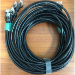

_The recommended network cable standards are CAT5e and CAT6._

#### (2)A switch that supports Power over Ethernet (PoE) connection is essential for providing both power and data 

### 3.1.2 Connection Operation
#### （1）Insert one end of the Ethernet cable into the Femto Mega device.
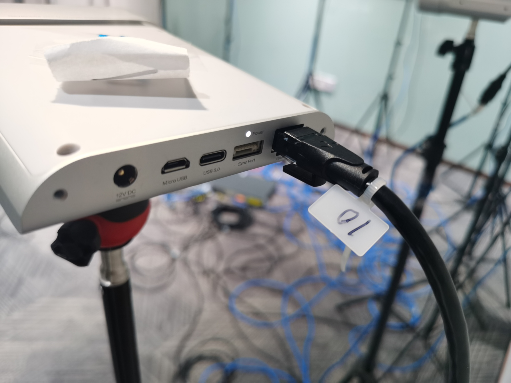
#### （2）Insert the other end of the Ethernet cable into the switch.
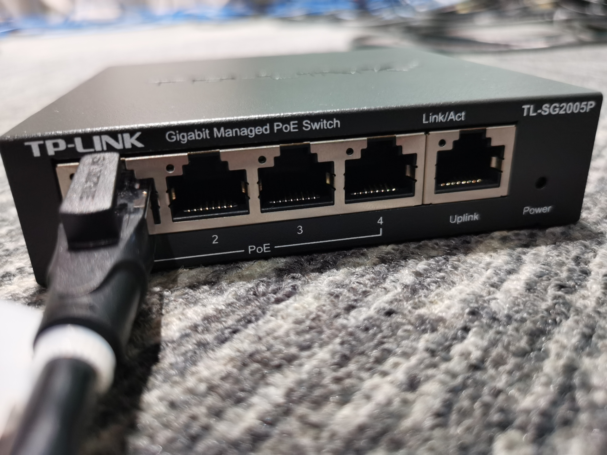
- Device Connection to Switch Verified by Indicator Lights.
- Computer Connection to the Switch.
## 3.2 Ethernet Hub Connection
### 3.2.1 Synchronization Cable Connection

#### (1)Connect the Synchronization Cable to Femto Mega

#### (2)Connecting the Other End of the Synchronization Cable to an Ethernet Hub

## 4.1 Configure IP Addresses
Start configuring the IP addresses for each device.
  - Set the IP address for the master device, for example: 192.168.0.10.
  - Set the IP address for the first slave device, for example: 192.168.0.11.
  - Set the IP address for the second slave device, for example: 192.168.0.12.
  - Continue this pattern for all devices, incrementing the last digit of the IP address for each subsequent device.
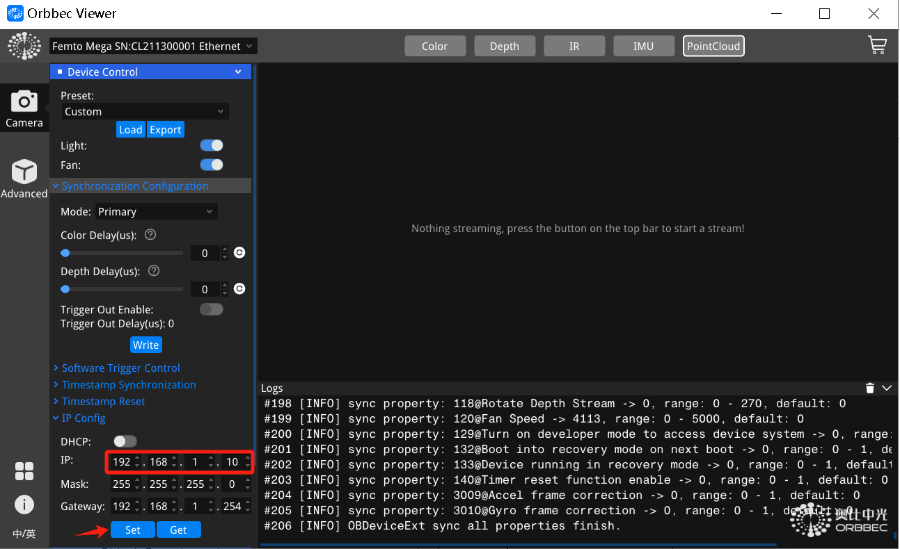
_Note: After updating the IP address, an error may occur because the device cannot receive the return value after the IP update. It is necessary to manually reconnect using the newly set IP address._
## 4.2 Configuring Multiple Network Cards on a Linux Computer
#### (1)Configure two network cards (NICs) on a Linux computer such that each is on a different network.
This sets eth0 to use a static IP address of 192.168.0.201, with a subnet mask of 255.255.255.0, and a gateway of 192.168.0.1.


This sets eth1 to use a static IP address of 192.168.1.202, with a subnet mask of 255.255.255.0, and a gateway of 192.168.1.1.
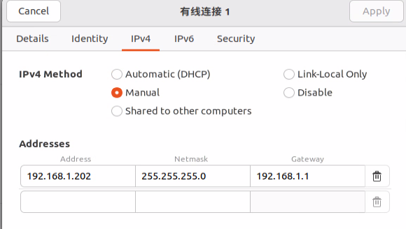

## 4.3 Testing Device Connections
#### (2)After setting up the IP addresses for your devices, you can perform a simple network test to confirm that your computer (PC) is connected to the devices. 
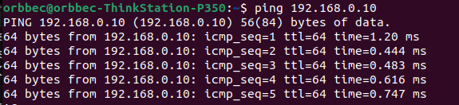
#### (3)Launch OrbbecViewer:：
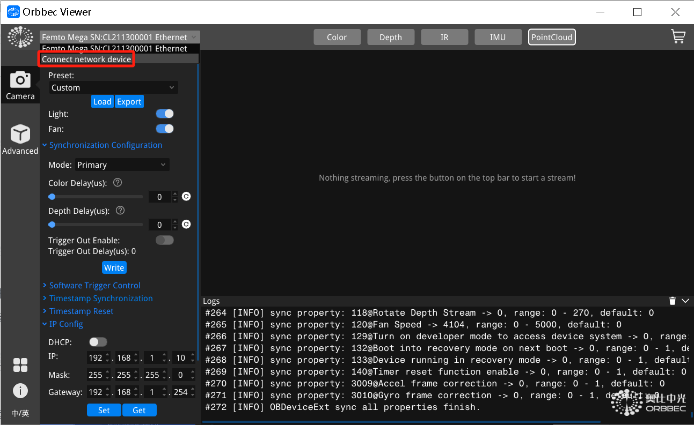
#### (4)Adding a Network Device in OrbbecViewer,Input Device IP
#### (5)Click "connect":

# 5. Software Configuration
## 5.1 Software Architecture
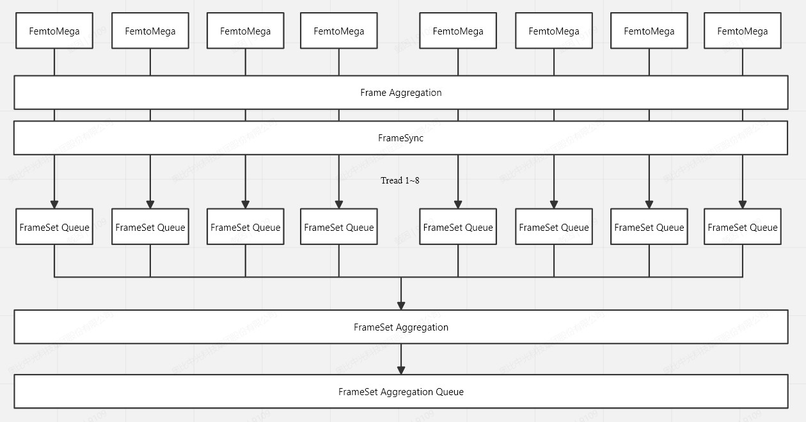
## 5.2 Software Configuration
### 5.2.1 Download the code
Clone or download this repository.
[https://github.com/orbbec/MultiDevicesSync.git](https://github.com/orbbec/MultiDevicesSync.git)
### 5.2.2 Configuring camera parameters through a configuration file
```cpp
"sn": "CL3N2410049",
"syncConfig": {
    "syncMode": "OB_MULTI_DEVICE_SYNC_MODE_PRIMARY",
    "depthDelayUs": 320,
    "colorDelayUs": 0,
    "trigger2ImageDelayUs": 0,
    "triggerOutEnable": true,
    "triggerOutDelayUs": 0,
    "framesPerTrigger": 1
}
```
sn: The SN number of the camera

syncMode: Specifies the synchronization mode of the camera; the master is set to OB_MULTI_DEVICE_SYNC_MODE_PRIMARY, and the slaves are set to OB_MULTI_DEVICE_SYNC_MODE_SECONDARY

depthDelayUs: The input delay of the ir/depth/tof trigger signal, in microseconds; 
(multiple cameras are sequentially spaced by 160us, such as device 1 at 0, device 2 at 160, device 3 at 320)

colorDelayUs: The input delay of the rgb trigger signal, in microseconds
trigger2ImageDelayUs: The delay from the trigger signal input to capturing the image, in microseconds

triggerOutEnable: The enable switch for the device's trigger signal output delay

triggerOutDelayUs: The delay of the device's trigger signal output, in microseconds

framesPerTrigger: The number of frames captured per trigger, effective only in software trigger mode and hardware trigger mode.
### 5.2.3 Accessing Devices via Specified IP Addresses
Since the OrbbecSDK on Linux currently cannot discover devices with multiple network cards through network enumeration, we access devices by specifying their IP addresses.
Example:

```cpp
std::string ip_10 = "192.168.0.10"; 
std::string ip_11 = "192.168.0.11";
std::string ip_12 = "192.168.0.12"; 
std::string ip_13 = "192.168.0.13"; 
std::string ip_14 = "192.168.1.14";  
std::string ip_15 = "192.168.1.15"; 
std::string ip_16 = "192.168.1.16"; 
std::string ip_17 = "192.168.1.17"; 

auto device_10 = context.createNetDevice(ip_10.c_str(), 8090); 
auto device_11 = context.createNetDevice(ip_11.c_str(), 8091); 
auto device_12 = context.createNetDevice(ip_12.c_str(), 8092);
auto device_13 = context.createNetDevice(ip_13.c_str(), 8093);
auto device_14 = context.createNetDevice(ip_14.c_str(), 8094);
auto device_15 = context.createNetDevice(ip_15.c_str(), 8095); 
auto device_16 = context.createNetDevice(ip_16.c_str(), 8096); 
auto device_17 = context.createNetDevice(ip_17.c_str(), 8097);
```
[代码地址](https://github.com/orbbec/MultiDevicesSync/blob/f27e6595ce674e7bb626bd2df5d86e6aca0048f7/MultiDeviceSync.cpp#L135C1-L177C7)
### 5.2.4 Set the number of current devices
```cpp
#define MAX_DEVICE_COUNT 8
```
[代码地址](https://github.com/orbbec/MultiDevicesSync/blob/f27e6595ce674e7bb626bd2df5d86e6aca0048f7/MultiDeviceSync.cpp#L24)
### 5.2.5 Avoiding Laser Interference Between Multiple Cameras
To prevent potential interference when pointing in the same direction, a minimum delay of 160 microseconds is recommended.
The actual pulse width is 125μs, but we declare it as 160μs to provide some leeway. Taking the NFOV resolution as an example, each 125μs pulse is followed by 1350μs of idle time. The purpose of staggering the exposure of two devices is to have the first pulse of the second camera fall within the first idle period of the first camera. The delay between the first and second cameras could be as low as 125μs (pulse width), but we recommend allowing some margin, thus 160μs. Given 160μs, you can stagger the exposure periods of up to 8 cameras at most. (In an eight-camera setup, a one-master-seven-slaves mode is adopted.)
#### (1)Laser Interference Phenomenon
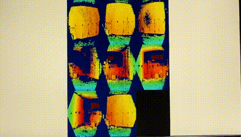
#### (2)Delay to Eliminate Laser Interference Effects

### 5.2.5 Open the terminal and navigate to the project directory
```
cd MultiCameraSync
```
### 5.2.6 Create and enter the build directory
```
mkdir build  
cd build
```
### 5.2.7 Run CMake to configure and build the project
```
cmake ..
make -j
```
### 5.2.8 Run the program
```
./MultiCameraSync 
```
# 6. System Product List
## 6.1 System Project and Material Description
a. 8 units of Femto Mega cameras.
https://store.orbbec.com/checkouts/cn/Z2NwLWFzaWEtc291dGhlYXN0MTowMUpCRTRIQ1E3WFZCR1QzSkJES0hCUU0zTQ

b. 8 units of 8P TO RJ45 conversion cables,
 Data Cable: EF2103 Multi-camera Synchronization Cable 8P TO RJ45, 0.15 meters.
https://store.orbbec.com/products/sync-adaptor-for-femto-mega-and-femto-bolt

c. 8 units of Femto Mega Ethernet Multi-Camera Sync HUBs.
https://store.orbbec.com/products/sync-hub-pro

d. 4 units of 5-port Gigabit PoE switches are recommended for purchase.
https://item.jd.com/10096782361958.html#crumb-wrap

e. 8 units of 5-meter RJ45 Ethernet cables. 
It is recommended that the cables used to connect to the Multi-Camera Sync Hub must be T568B-T568B cables.
https://item.m.jd.com/product/100005267660.html

f. Lenovo Type-C Expansion Dock, USB-C to RJ45 Ethernet adapter, USB 3.0 hub, is recommended for purchase.
https://item.jd.com/100018111486.html#crumb-wrap

g. Femto Mega Multi-Camera Synchronization Software.
https://github.com/orbbec/MultiDevicesSync.git