# FemtoMega多机同步示例

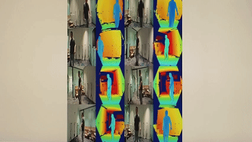


- [FemtoMega多机同步示例](#femtomega多机同步示例)
- [1. 项目背景](#1-项目背景)
- [2. 硬件连接](#2-硬件连接)
  - [2.1  设备连接方式](#21--设备连接方式)
    - [2.1.1 连接拓扑图](#211-连接拓扑图)
      - [（1）同步设备连接：](#1同步设备连接)
      - [(2) 设备网络连接：](#2-设备网络连接)
  - [2.2  设备清单](#22--设备清单)
    - [2.2.1 FemtoMega](#221-femtomega)
    - [2.2.2 同步触发线](#222-同步触发线)
    - [2.2.3 同步集线器(专业版Hub)](#223-同步集线器专业版hub)
    - [2.2.4 电脑配置](#224-电脑配置)
- [3. 硬件连接指南](#3-硬件连接指南)
  - [3.1 FemtoMega 通过 POE 连接 交换机](#31-femtomega-通过-poe-连接-交换机)
    - [3.1.1 材料准备](#311-材料准备)
      - [(1)网线若干](#1网线若干)
      - [(2)支持POE连接的交换机](#2支持poe连接的交换机)
    - [3.1.2 连接操作](#312-连接操作)
      - [（1）将网线一端插入FemtoMega](#1将网线一端插入femtomega)
      - [（2）将网线另一端插入交换机](#2将网线另一端插入交换机)
  - [3.2 以太网集线器连接](#32-以太网集线器连接)
    - [3.2.1同步线连接](#321同步线连接)
      - [(1)同步线一端连接 FemtoMega](#1同步线一端连接-femtomega)
      - [(2)同步线另一端接入以太网集线器](#2同步线另一端接入以太网集线器)
- [4.网络连接配置](#4网络连接配置)
  - [4.1 配置每台设备IP](#41-配置每台设备ip)
  - [4.2 linux下电脑多网卡配置](#42-linux下电脑多网卡配置)
  - [4.3 测试设备连接](#43-测试设备连接)
    - [4.3.1 设置好之后可以之后可以先在终端ping一下设备IP，确认PC 已经连上设备。](#431-设置好之后可以之后可以先在终端ping一下设备ip确认pc-已经连上设备)
    - [4.3.2 打开OrbbecViewer, 如下图所示：](#432-打开orbbecviewer-如下图所示)
    - [4.3.3 点击添加网络设备，弹出如下框：,输入设备IP，点击确认](#433-点击添加网络设备弹出如下框输入设备ip点击确认)
    - [4.3.4 点击 "connect"](#434-点击-connect)
- [5. 软件配置](#5-软件配置)
  - [5.1 软件架构](#51-软件架构)
  - [5.2 软件配置](#52-软件配置)
    - [5.2.1 下载代码](#521-下载代码)
    - [5.2.2 通过配置文件配置相机参数](#522-通过配置文件配置相机参数)
    - [5.2.3 通过指定ip访问设备](#523-通过指定ip访问设备)
    - [5.2.4 设置当前设备数和连接模式](#524-设置当前设备数和连接模式)
    - [5.2.5 避免多台相机之间的激光干扰](#525-避免多台相机之间的激光干扰)
      - [(1)激光干扰现象](#1激光干扰现象)
      - [(2)延时消除激光干扰效果](#2延时消除激光干扰效果)
    - [5.2.5 打开终端，进入项目目录](#525-打开终端进入项目目录)
    - [5.2.6 创建并进入构建目录](#526-创建并进入构建目录)
    - [5.2.7 运行 CMake 来配置和构建项目](#527-运行-cmake-来配置和构建项目)
    - [5.2.8 运行程序](#528-运行程序)
- [6. 系统产品清单](#6-系统产品清单)
  - [6.1 系统项目及材料说明](#61-系统项目及材料说明)


# 1. 项目背景
在医学、体育科学、人体工程学等研究领域，动态三维人体重建技术正逐渐成为推动教学与研究进步的关键力量，这项技术通过精确捕捉和重建人体运动的三维数据，为研究人员提供了一个全新的视角来理解和分析人体结构与功能；这项技术更广泛商业应用是在容积视频（也称：体积视频），容积视频是通过捕捉并重建三维空间中的人体和物体，创造出可以在虚拟空间中自由观察和交互的全息影像；FemtoMega 多机同步示例是动态三维人体重建技术的基础模块，实现多台RGBD数据同步采集。
# 2. 硬件连接
## 2.1  设备连接方式
本方案采用星型连接方式（专业版同步盒子）。
 注意: 测试之前需要拆除白色外壳，然后可以看到有更多的接口。
### 2.1.1 连接拓扑图
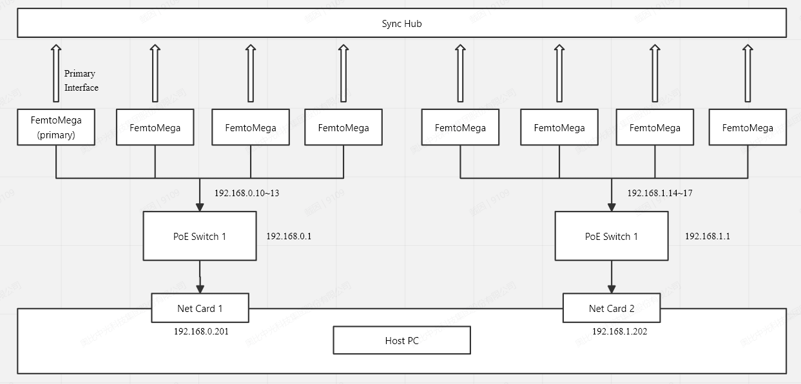
#### （1）同步设备连接：
其中一台为主机，7台为从机。
#### (2) 设备网络连接：
网络设备连接，共使用8台RGBD相机，2台交换机。1台交换机连接四台设备，每个交换机的ip需要隔离（如：192.168.0.1；192.168.1.1），电脑的4个网卡ip需要分别和对应的交换机在同一网段（如：192.168.0.201；192.168.1.202）。
## 2.2  设备清单
### 2.2.1 FemtoMega
FemtoMega 是奥比中光与微软联合打造的一款先进iToF 3D相机，作为微软官方推荐的 Azure Kinect DK 替代选择，FemtoMega深度相机采用了微软最新的先进ToF传感技术，拥有与微软 Azure Kinect DK 深度相机完全一致的工作模式和性能表现。
### 2.2.2 同步触发线
主机需要用到同步线向从机发送触发信号,  同步触发线 如下图所示：
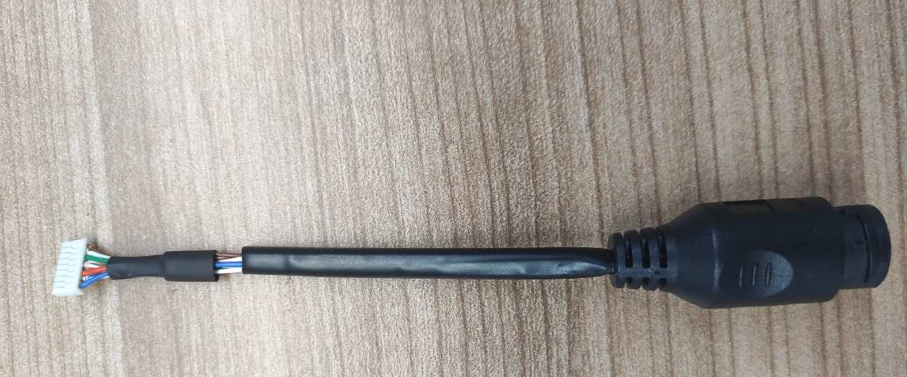
FemtoMega 同步触发线 8Pin插座的管脚功能定义、线材颜色、管脚顺序 如下：
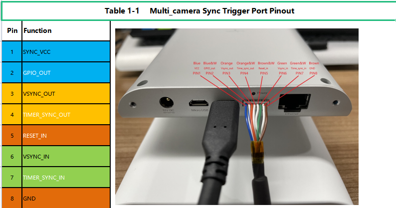

_注意： 当设备正放时，从左到右Pin脚的顺序时1到8._
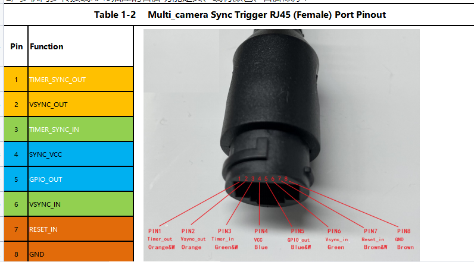
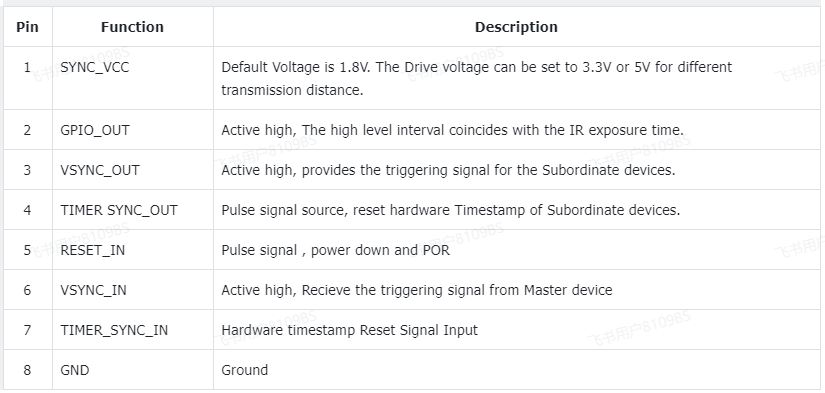
### 2.2.3 同步集线器(专业版Hub)
多机同步Hub的正面如图所示：
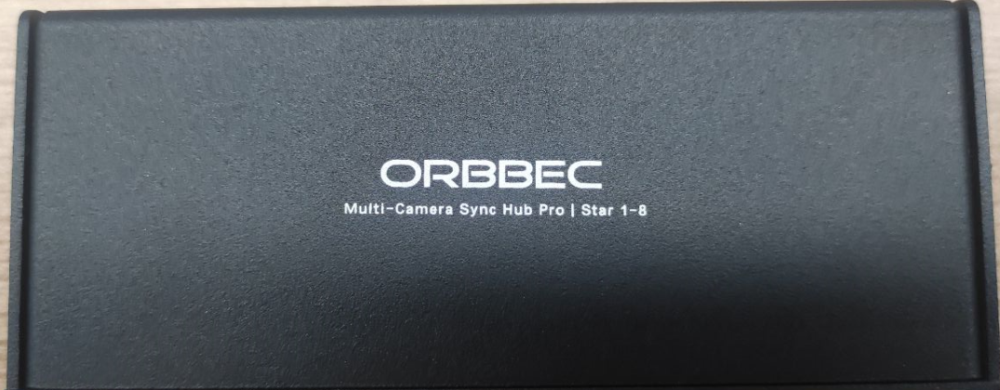

多机同步hub的2个侧面 示意图如下：

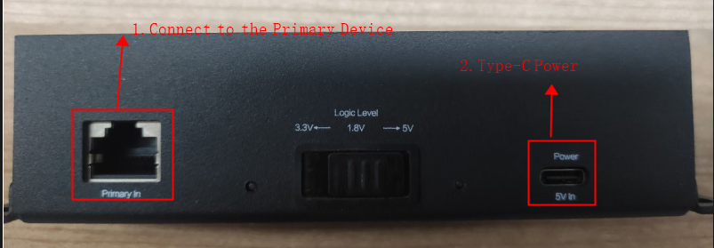

Primary In ： 表示接主设备。
Power 5v In： 表示 Hub需要通过 TypeC 5V供电。（Logic Level默认拨到1.8V）

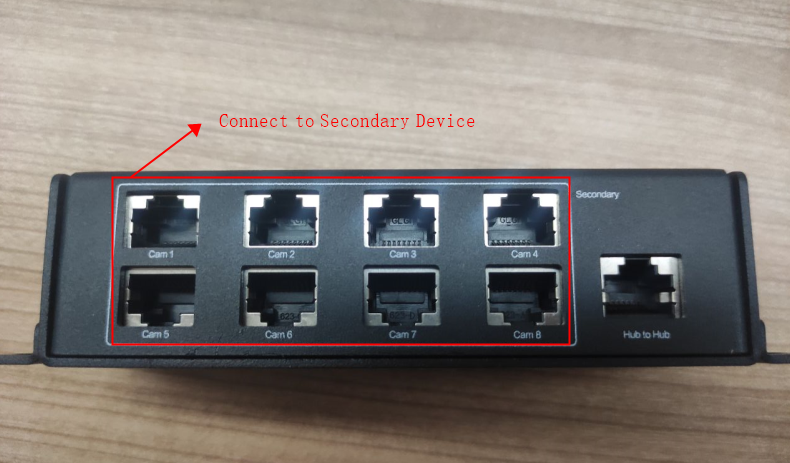

对于星型连接，一个hub上最多可以接 8个从设备。如果要使用链型连接，可以通过 Hub to Hub，再扩展成多个Hub。

_注意： 接多机同步Hub的网线 必须是 T568B-T568B的网线。_

### 2.2.4 电脑配置
当前测试使用电脑配置（供参考）:
- CPU: 11th Gen i7 / 2.5GHz * 16 cores
- RAM: 32GB
- Graphics: GPU NVIDIA 3060
- Operating System: Ubuntu 22.04
# 3. 硬件连接指南
## 3.1 FemtoMega 通过 POE 连接 交换机
### 3.1.1 材料准备
#### (1)网线若干
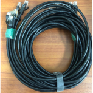

_网线建议标准CAT5e，CAT6。_

#### (2)支持POE连接的交换机
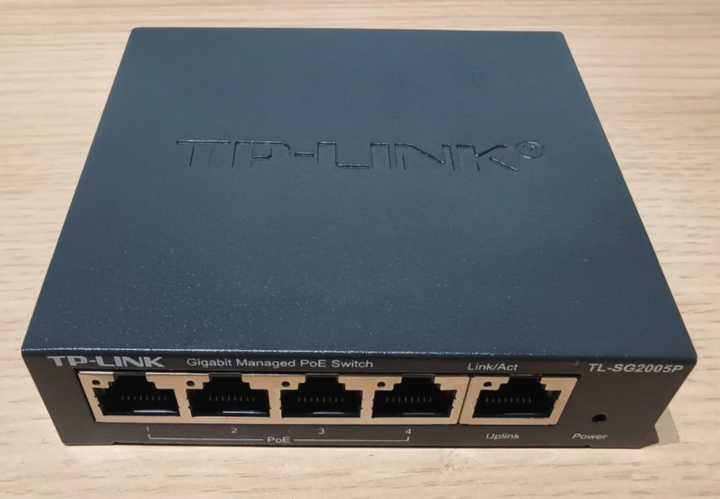
### 3.1.2 连接操作
#### （1）将网线一端插入FemtoMega
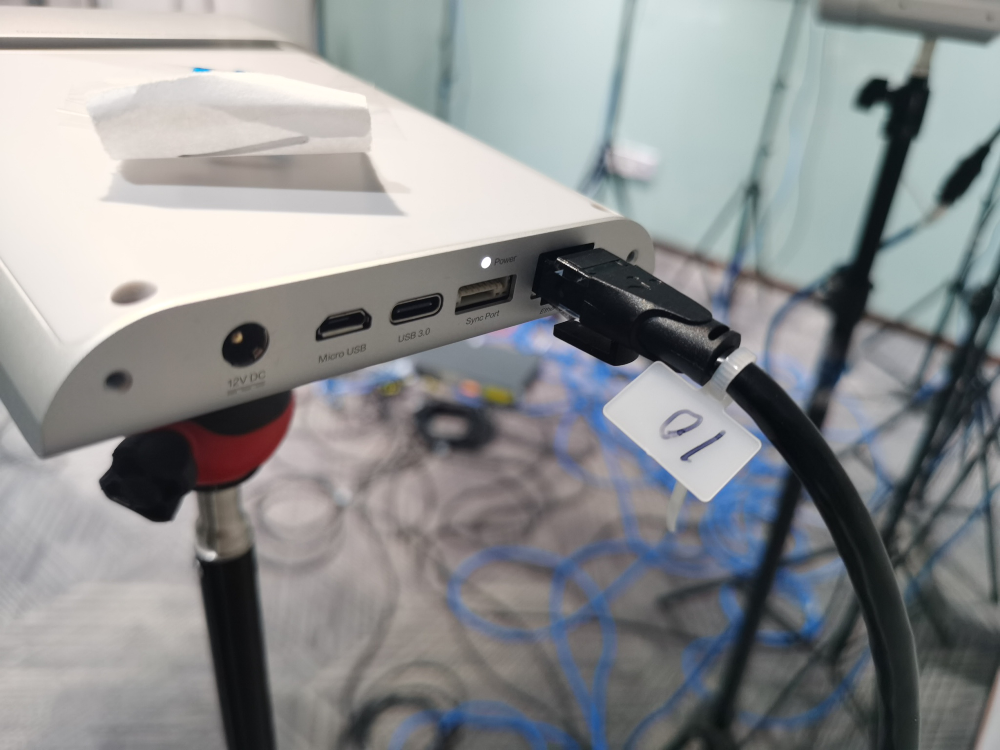
#### （2）将网线另一端插入交换机
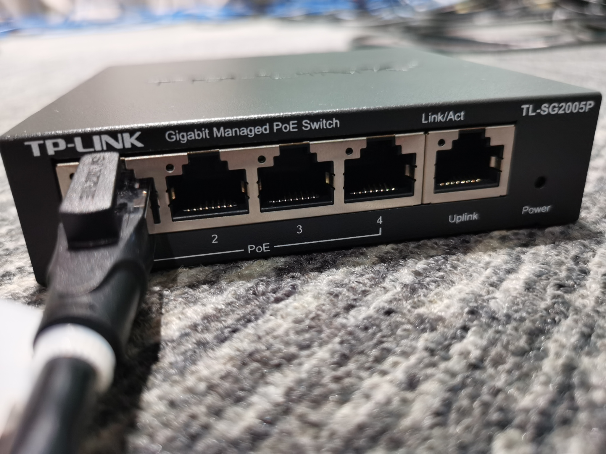
- 设备接到交换机，可通过指示灯确定连接状态。
- 电脑连接到交换机。
## 3.2 以太网集线器连接
### 3.2.1同步线连接

#### (1)同步线一端连接 FemtoMega
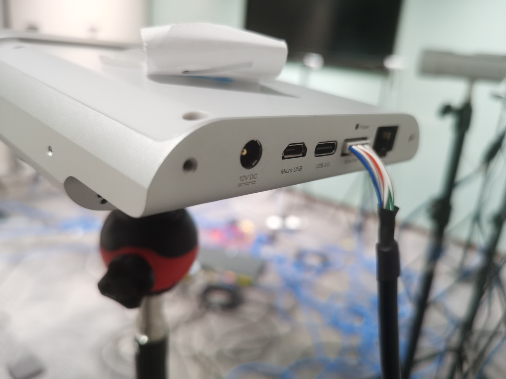
#### (2)同步线另一端接入以太网集线器
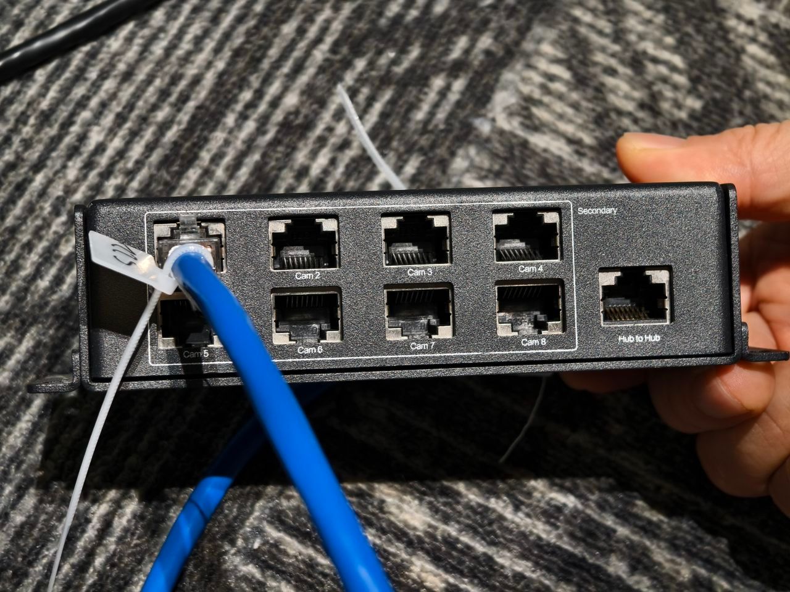
# 4.网络连接配置
## 4.1 配置每台设备IP
OrbbecViewer中"相机控制"模块中"设备控制"栏找到ip配置, 修改完IP后点击“update”。建议按照位置摆放顺序设置最后一位，比如主机IP：192.168.0.10，从机1 IP：192.168.0.11，从机2 IP：192.168.0.12等。
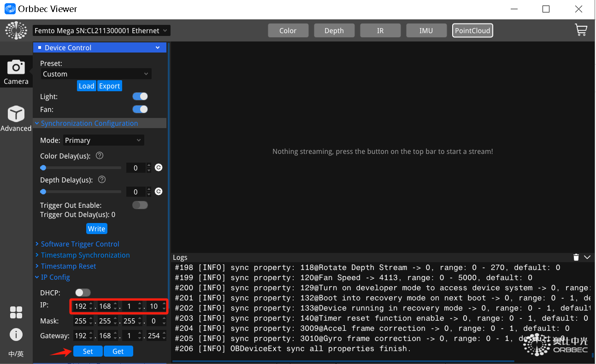
_【注意】更新IP之后会返回错误，因为IP更新之后设备拿不到返回值。需要重新手动连接新设置的IP。_
## 4.2 linux下电脑多网卡配置
将两个网卡的IP分别设置在两个不同的网络下
网卡1的配置可将地址设置为192.168.1.201，子网掩码设置为255.255.255.0，网关设置为192.168.0.1
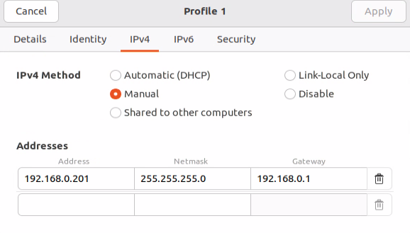

网卡2的配置可将地址设置为192.168.1.202，子网掩码设置为255.255.255.0，网关设置为192.168.1.1
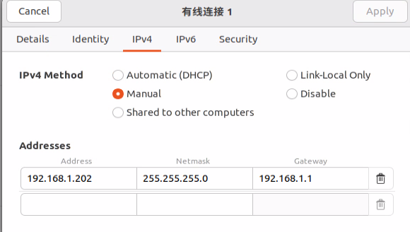

## 4.3 测试设备连接
### 4.3.1 设置好之后可以之后可以先在终端ping一下设备IP，确认PC 已经连上设备。
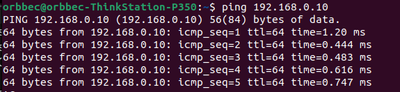
### 4.3.2 打开OrbbecViewer, 如下图所示：
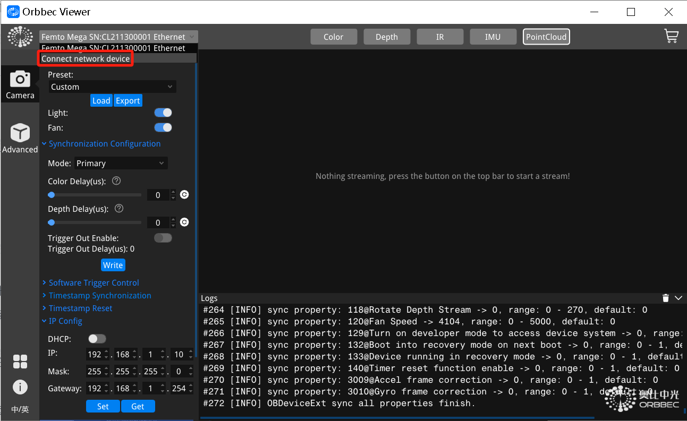
### 4.3.3 点击添加网络设备，弹出如下框：,输入设备IP，点击确认
连接成功界面如下：
### 4.3.4 点击 "connect"
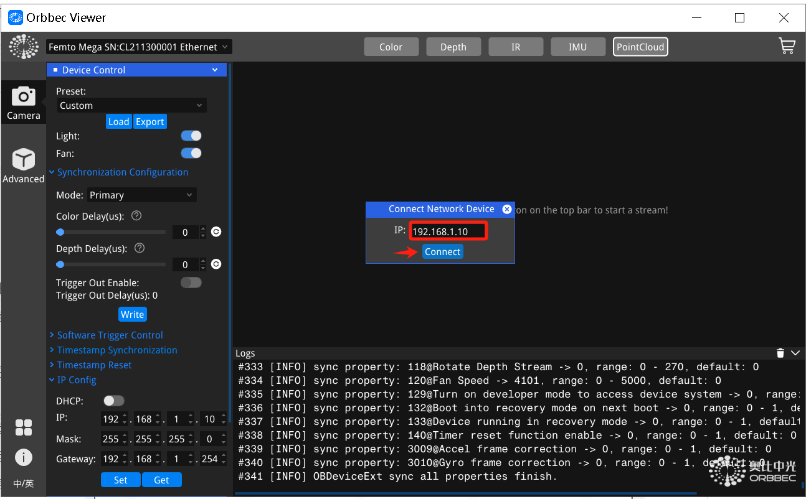
# 5. 软件配置
## 5.1 软件架构
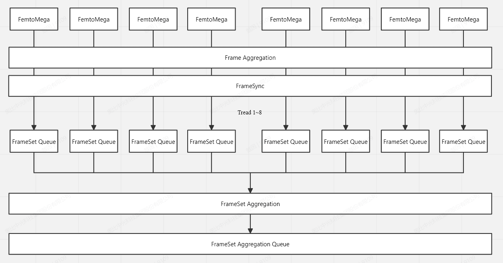
## 5.2 软件配置
### 5.2.1 下载代码
克隆或下载此仓库。 
[https://github.com/orbbec/MultiDevicesSync.git](https://github.com/orbbec/MultiDevicesSync.git)
### 5.2.2 通过配置文件配置相机参数
```cpp
"sn": "CL3N2410049",
"syncConfig": {
    "syncMode": "OB_MULTI_DEVICE_SYNC_MODE_PRIMARY",
    "depthDelayUs": 320,
    "colorDelayUs": 0,
    "trigger2ImageDelayUs": 0,
    "triggerOutEnable": true,
    "triggerOutDelayUs": 0,
    "framesPerTrigger": 1
}
```
sn: 相机的SN号
syncMode: 指定相机的同步模式；主机设置为OB_MULTI_DEVICE_SYNC_MODE_PRIMARY，从机设置为OB_MULTI_DEVICE_SYNC_MODE_SECONDARY
depthDelayUs：ir/depth/tof 触发信号输入延时，单位微秒；(多个相机依次间隔160us，如设备1为0，设备2为160，设备3为320)
colorDelayUs：rgb 触发信号输入延时，单位微秒
trigger2ImageDelayUs：触发信号输入到捕获图像的延时，单位微秒
triggerOutEnable：设备触发信号输出延迟的使能开关
triggerOutDelayUs：设备触发信号输出延时，单位微秒
framesPerTrigger：单次触发图像采集的帧数，仅在软件触发模式和硬件触发模式下有效。
### 5.2.3 通过指定ip访问设备
由于目前linux下OrbbecSDK暂无法通过网络枚举方式发现多个网卡的设备，所以通过指定ip访问设备的方式。
例：

```cpp
std::string ip_10 = "192.168.0.10"; 
std::string ip_11 = "192.168.0.11";
std::string ip_12 = "192.168.0.12"; 
std::string ip_13 = "192.168.0.13"; 
std::string ip_14 = "192.168.1.14";  
std::string ip_15 = "192.168.1.15"; 
std::string ip_16 = "192.168.1.16"; 
std::string ip_17 = "192.168.1.17"; 

auto device_10 = context.createNetDevice(ip_10.c_str(), 8090); 
auto device_11 = context.createNetDevice(ip_11.c_str(), 8091); 
auto device_12 = context.createNetDevice(ip_12.c_str(), 8092);
auto device_13 = context.createNetDevice(ip_13.c_str(), 8093);
auto device_14 = context.createNetDevice(ip_14.c_str(), 8094);
auto device_15 = context.createNetDevice(ip_15.c_str(), 8095); 
auto device_16 = context.createNetDevice(ip_16.c_str(), 8096); 
auto device_17 = context.createNetDevice(ip_17.c_str(), 8097);
```
[代码地址](https://github.com/orbbec/MultiDevicesSync/blob/f27e6595ce674e7bb626bd2df5d86e6aca0048f7/MultiDeviceSync.cpp#L135C1-L177C7)
### 5.2.4 设置当前设备数和连接模式
```cpp
#define MAX_DEVICE_COUNT 8
```
[代码地址](https://github.com/orbbec/MultiDevicesSync/blob/f27e6595ce674e7bb626bd2df5d86e6aca0048f7/MultiDeviceSync.cpp#L24)

```cpp
ConnectionType connectionType = ConnectionType::LINUX_NET;
```
[代码地址](https://github.com/orbbec/MultiDevicesSync/blob/6b784d0689c68f743b793de6fcb14ff6412eb532/MultiDeviceSync.cpp#L34)

### 5.2.5 避免多台相机之间的激光干扰 
为避免指向同一方向时可能出现的干扰，建议的最小延迟为 160us。 
实际脉冲宽度为125μs，但我们声明为160us以提供一些回旋余地。以NFOV解为例，每个125μs脉冲后跟1350μs空闲。可以交错曝光2台设备的作用是让第二台相机的第一个脉冲落在第一台相机的第一个空闲期。第一和第二相机之间的延迟可能低至125μs（脉冲宽度），但我们建议留出一些余地，因此为160μs。给定160μs，您最多可以交错8个相机的曝光周期。（八台搭建系统采用一主七从模式）
#### (1)激光干扰现象

#### (2)延时消除激光干扰效果
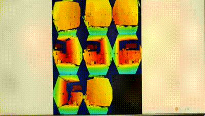
### 5.2.5 打开终端，进入项目目录 
```
cd MultiCameraSync
```
### 5.2.6 创建并进入构建目录
```
mkdir build  
cd build
```
### 5.2.7 运行 CMake 来配置和构建项目 
```
cmake ..
make -j
```
### 5.2.8 运行程序
```
./MultiCameraSync 
```
# 6. 系统产品清单
## 6.1 系统项目及材料说明
a.8台FemtoMega 。
https://store.orbbec.com/checkouts/cn/Z2NwLWFzaWEtc291dGhlYXN0MTowMUpCRTRIQ1E3WFZCR1QzSkJES0hCUU0zTQ

b.8根 8P TO RJ45转接线，EF2103多机同步转接线 8P TO RJ45 0.15米。
https://store.orbbec.com/products/sync-adaptor-for-femto-mega-and-femto-bolt

c.8个FemtoMega以太网多机同步HUB。
https://store.orbbec.com/products/sync-hub-pro

d.5口千兆带POE的交换机，购买推荐（4个）
https://item.jd.com/10096782361958.html#crumb-wrap

e.8根5米RJ45网线 ，接多机同步Hub的网线必须是 T568B-T568B的网线，购买推荐
https://item.m.jd.com/product/100005267660.html

f.Lenovo Type-C拓展坞扩展坞转千兆网口, USB-C转RJ45有线网卡转接头电脑转换器USB3.0分线器,购买推荐
https://item.jd.com/100018111486.html#crumb-wrap