# Femto Series Multi Device Synchronization

## 1. Supported Devices

| Product | Support sync mode |
| -------- | ---- |
| Femto Mega | Primary, Secondary, Software Triggering |
| Femto Mega I | Primary, Secondary, Software Triggering |
| Femto Bolt | Primary, Secondary |


## 2 USB Connection

Femto Bolt and Femto Mega support USB Connection.

- USB devices must be connected to a sync hub (via the 8-pin port). Please refer to the [Multi-device Sync documentation](https://www.orbbec.com/docs-general/set-up-cameras-for-external-synchronization_v1-2/).


- When applying an external sync pulse, the HW SYNC input requires a 100-microsecond positive pulse at the nominal camera frame rate, e.g. 33.33 ms for a 30 Hz frame rate. Inputs are high impedance, **1.8V CMOS voltage levels**. However, it is important to make sure to use a high-resolution signal generator. The frequency of the signal generator needs to exactly match the sensor frame rate. For example, if the sensor is set up as 30 FPS, the
real frame rate may be 30.015 FPS. You may need to use an oscilloscope to measure the real frame rate and configure the signal generator to the same frequency. For this reason, it may be better to just use one additional camera as the primary sync signal generator.


## 3 Ethernet connection

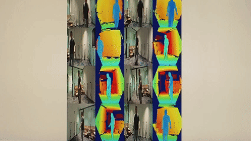


The Femto Mega series connects to PC via Ethernet (PoE), with sync signals transmitted through 8-pin sync cables and a sync hub. This solution uses a star topology connection (Professional Sync Hub).

Note: Before testing, remove the white outer casing to reveal additional ports.


Femto Mega is an advanced iToF 3D camera co-developed by Orbbec and Microsoft. As the officially recommended replacement for the Microsoft Azure Kinect DK, the FemtoMega depth camera adopts Microsoft's latest advanced ToF sensing technology and delivers identical operating modes and performance to the Microsoft Azure Kinect DK depth camera.

### 3.1 Sync Trigger Cable

The PRIMARY device uses a sync cable to send trigger signals to the SECONDARY devices. The sync trigger cable is shown below:
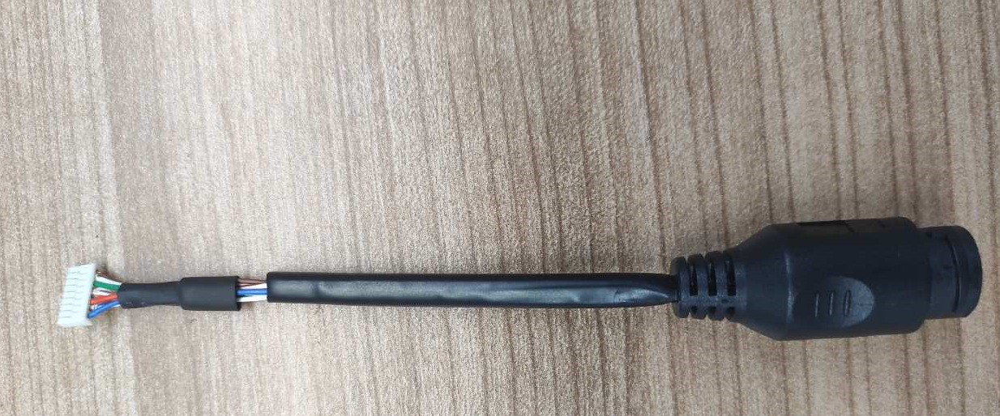

The pin function definitions, wire colors, and pin order of the FemtoMega sync trigger cable 8-pin connector are as follows:
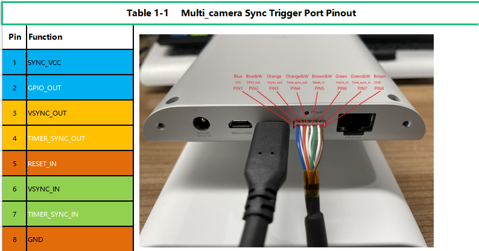

_Note: When the device is placed upright, the pin order from left to right is 1 to 8._
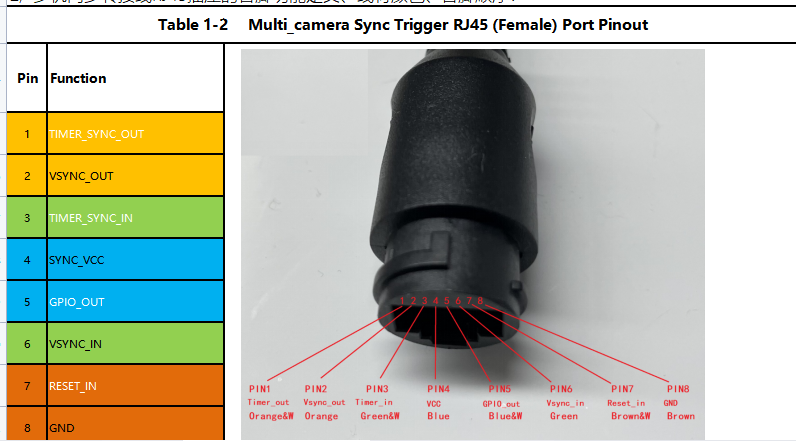
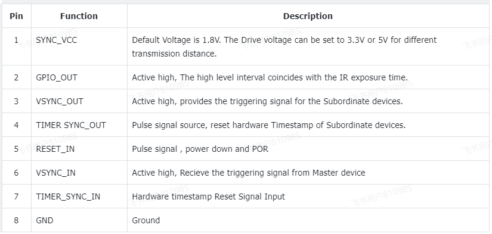

### 3.2 Sync Hub (Professional Hub)

The front of the multi-device sync Hub is shown below:
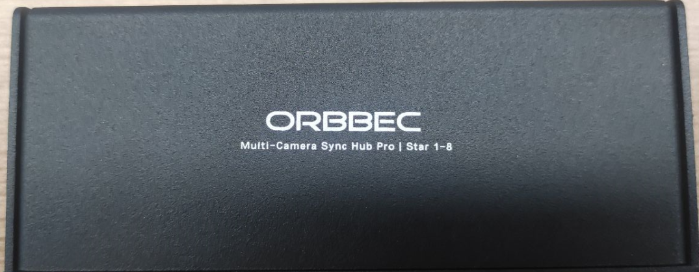

The two side views of the multi-device sync Hub are shown below:
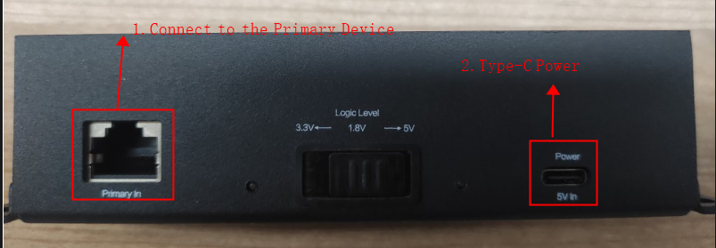

Primary In: Connects to the PRIMARY device.
Power 5V In: The Hub requires power via Type-C 5V. (Logic Level is set to 1.8V by default.)

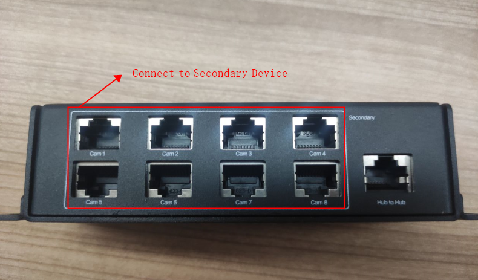

For star topology connections, a single hub can connect up to 8 SECONDARY devices. For daisy-chain connections, you can use Hub to Hub to expand across multiple hubs.

_Note: The Ethernet cable connecting to the multi-device sync Hub must be a T568B-T568B cable._

### 3.3 Connection Topology

Ethernet connection uses PoE switches to power devices and transmit data, with sync signals transmitted through 8-pin cables and a sync hub.

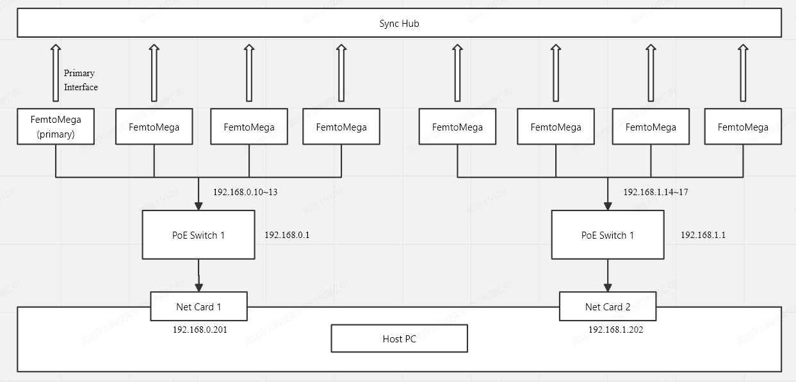

One device serves as the PRIMARY, and the rest serve as SECONDARY. Network device connections recommend no more than 4 devices per switch, with IP subnets isolated across multiple switches (e.g., 192.168.0.x and 192.168.1.x). The PC's multiple NICs must be on the same subnet as their corresponding switches.

#### 3.3.1 Connection Steps

##### 3.3.1.1 Materials Preparation

Ethernet cables (recommended standard CAT5e, CAT6):
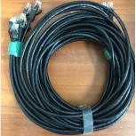

PoE-enabled network switch:
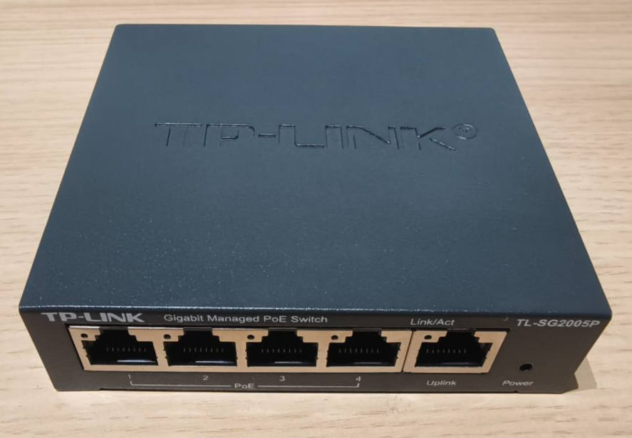

##### 3.3.1.2 PoE Connection

1. Plug one end of the Ethernet cable into Femto Mega:
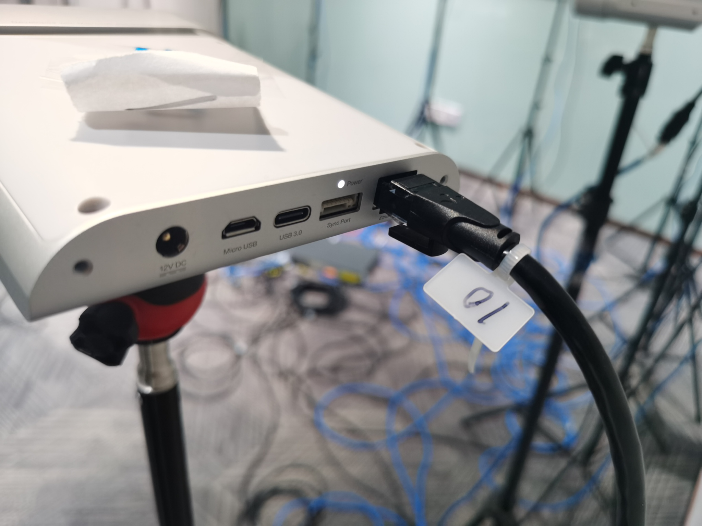

2. Plug the other end of the Ethernet cable into the switch:
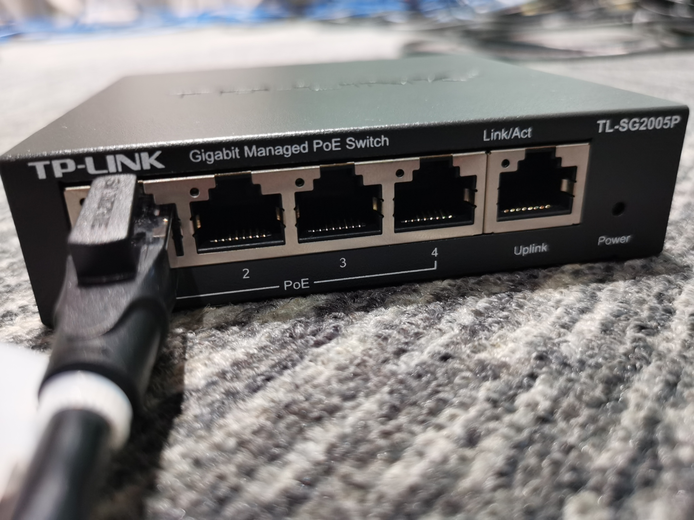

3. Once the device is connected to the switch, check the indicator lights to confirm the connection status
4. Connect the PC to the switch

##### 3.3.1.3 Sync Cable Connection

1. Connect one end of the sync cable to Femto Mega:
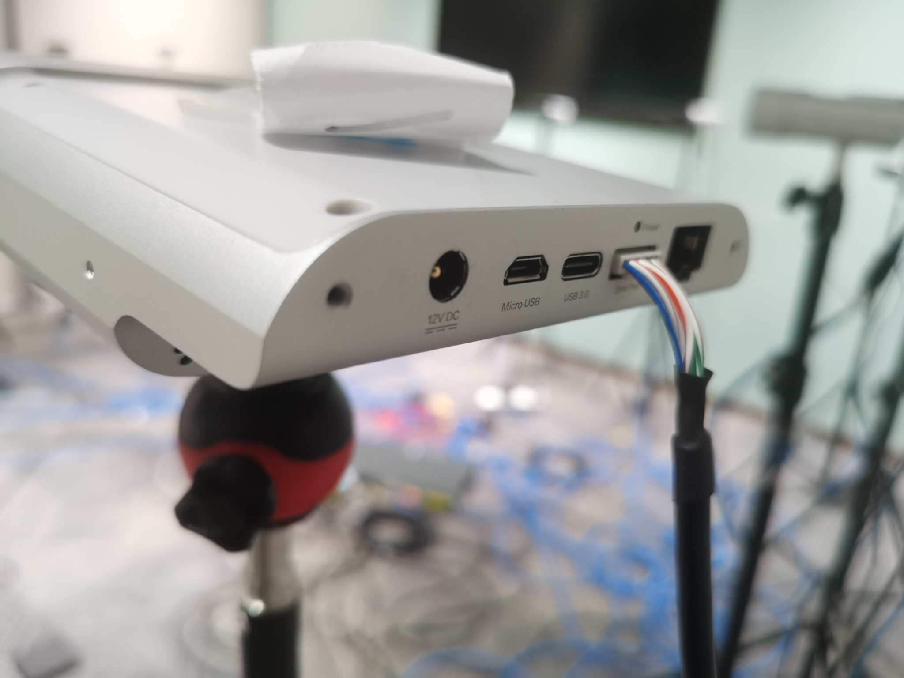

2. Connect the other end of the sync cable to the sync hub:
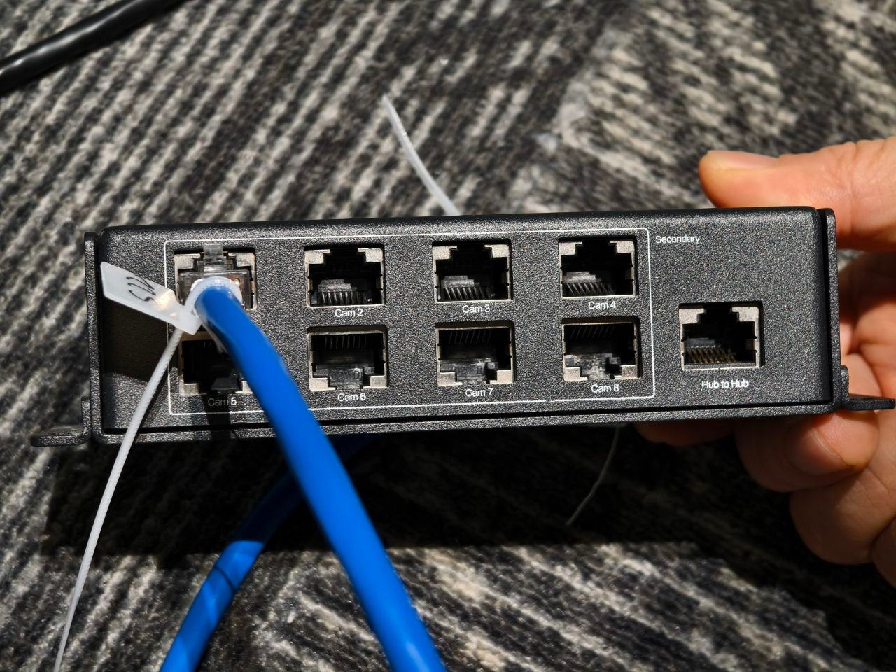

#### 3.3.2 Platform Requirements

The PC configuration used during testing (for reference):
- CPU: 11th Gen i7 / 2.5GHz * 16 cores
- RAM: 32GB
- Graphics: GPU NVIDIA 3060
- Operating System: Ubuntu 22.04

### 3.4 Network Connection Configuration

#### 3.4.1 Configuring Each Device's IP

Each device needs to be configured with a unique IP address. In OrbbecViewer, find the IP configuration under the "Device Control" section within the "Camera Control" module. After modifying the IP, click "update". It is recommended to set the last octet based on the physical placement order, e.g., PRIMARY IP: 192.168.0.10, SECONDARY 1 IP: 192.168.0.11, SECONDARY 2 IP: 192.168.0.12, etc.
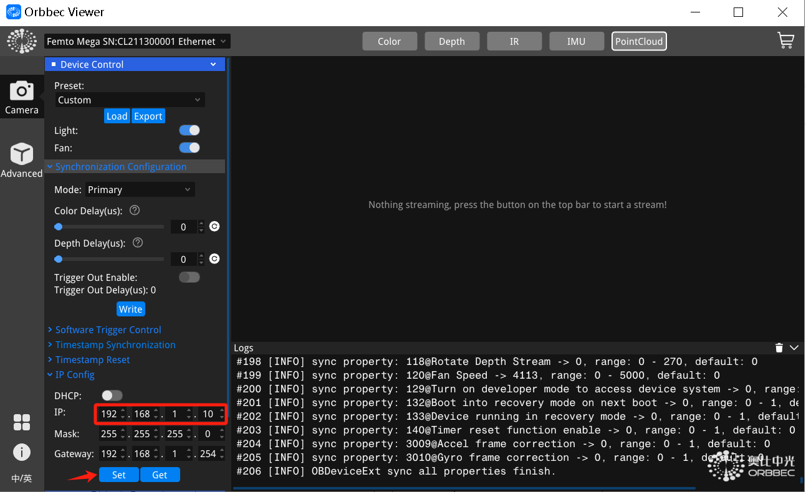

_Note: After updating the IP, an error will be returned because the device cannot send a response after its IP changes. You need to manually reconnect using the newly configured IP._

#### 3.4.2 Configuring Multiple Network Adapters on Linux

Set the IP addresses of the two network adapters to different subnets:

Network adapter 1: set the address to 192.168.1.201, subnet mask to 255.255.255.0, gateway to 192.168.0.1:
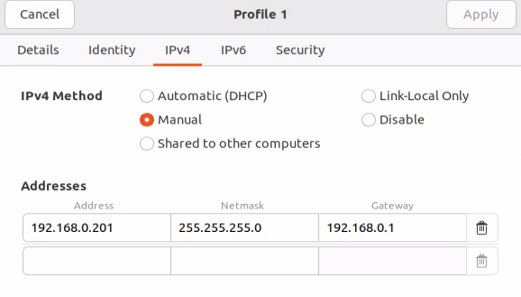

Network adapter 2: set the address to 192.168.1.202, subnet mask to 255.255.255.0, gateway to 192.168.1.1:
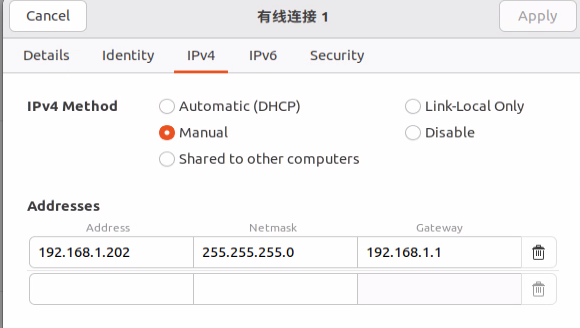

#### 3.4.3 Testing Device Connection

After configuration, you can first ping the device IP in the terminal to confirm the PC is connected to the device:
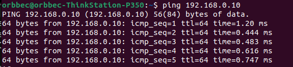


## 4 Sync Modes


### 4.1 PRIMARY/SECONDARY Mode

The standard hardware cable sync mode. One device acts as the PRIMARY (master) outputting sync trigger signals, while the other devices act as SECONDARY (slaves) receiving trigger signals, achieving frame exposure synchronization across all devices.

**Use case:** Multi-device synchronized capture via Ethernet connection, using the standard 8-pin sync cable + sync hub solution.

**How it works:**

1. The PRIMARY device sends a hardware trigger signal via the 8-pin sync cable at each frame exposure.
2. The sync hub distributes the signal to all SECONDARY devices.
3. SECONDARY devices perform exposure capture upon receiving the trigger signal.
4. The `depthDelayUs` parameter enables staggered exposure between devices to avoid laser interference. It is the input delay of the IR/Depth/ToF trigger signal in microseconds (multiple cameras are sequentially spaced by 160us, such as device 1 at 0, device 2 at 160, device 3 at 320).

**Startup sequence:**

1. Start all SECONDARY devices first (wait for initialization to complete).
2. Start the PRIMARY device last.

**Configuration example (Primary):**

```json
{
    "sn": "CP123456789",
    "syncConfig": {
        "syncMode": "OB_MULTI_DEVICE_SYNC_MODE_PRIMARY",
        "depthDelayUs": 0,
        "colorDelayUs": 0,
        "trigger2ImageDelayUs": 0,
        "triggerOutEnable": true,
        "triggerOutDelayUs": 0,
        "framesPerTrigger": 1
    }
}
```

**Configuration example (Secondary):**

```json
{
    "sn": "CP123456710",
    "syncConfig": {
        "syncMode": "OB_MULTI_DEVICE_SYNC_MODE_SECONDARY",
        "depthDelayUs": 160,
        "colorDelayUs": 0,
        "trigger2ImageDelayUs": 0,
        "triggerOutEnable": true,
        "triggerOutDelayUs": 0,
        "framesPerTrigger": 1
    }
}
```


### 4.2 SOFTWARE_TRIGGERING Mode

Set as software trigger (passive trigger; when there is a trigger command input from the host computer and the trigger command time interval is not less than the current upper limit, the image is collected according to the trigger command; when there is no trigger command, the image is not collected).


**How it works:**

1. All devices are configured in SOFTWARE_TRIGGERING mode.
2. Devices enter a standby state, waiting for the PC to issue a trigger command.
3. The user presses the `T` key in the preview window; the program calls `device->triggerCapture()` to trigger capture.
4. All devices expose and capture simultaneously upon receiving the trigger command.

**Configuration example:**

```json
{
    "sn": "CP123456789",
    "syncConfig": {
        "syncMode": "OB_MULTI_DEVICE_SYNC_MODE_SOFTWARE_TRIGGERING",
        "depthDelayUs": 0,
        "colorDelayUs": 0,
        "trigger2ImageDelayUs": 0,
        "triggerOutEnable": false,
        "triggerOutDelayUs": 0,
        "framesPerTrigger": 1
    }
}
```

### 4.3 Software Configuration


#### 4.3.1 syncConfig Field Reference

| Field | Type | Description |
| ---- | ---- | ---- |
| `syncMode` | string | Sync mode. Available values: `OB_MULTI_DEVICE_SYNC_MODE_PRIMARY`, `OB_MULTI_DEVICE_SYNC_MODE_SECONDARY`, `OB_MULTI_DEVICE_SYNC_MODE_SOFTWARE_TRIGGERING` |
| `depthDelayUs` | number | IR/Depth/ToF trigger signal input delay in microseconds. Multiple devices are staggered at 160us intervals to avoid laser interference, e.g., device 1 = 0, device 2 = 160, device 3 = 320 |
| `colorDelayUs` | number | RGB trigger signal input delay in microseconds. Typically set to 0 |
| `trigger2ImageDelayUs` | number | Delay from trigger signal input to image capture in microseconds. Typically set to 0 |
| `triggerOutEnable` | boolean | Device trigger signal output enable switch. Set to true for PRIMARY/SECONDARY mode, false for SOFTWARE_TRIGGERING and HARDWARE_TRIGGERING mode |
| `triggerOutDelayUs` | number | Device trigger signal output delay in microseconds. Typically set to 0 |
| `framesPerTrigger` | number | Number of frames captured per trigger. Only effective in SOFTWARE_TRIGGERING and HARDWARE_TRIGGERING modes, typically set to 1 |

### 4.4 Avoiding Laser Interference Between Multiple Cameras

To avoid interference that may occur when cameras point in the same direction, the recommended minimum delay is 160us. The actual pulse width is 125us, but we specify 160us to provide some margin. Taking the NFOV binning example, each 125us pulse is followed by 1350us of idle time. The way to interleave exposures for 2 devices is to have the second camera's first pulse fall within the first camera's first idle period. The delay between the first and second cameras can be as low as 125us (the pulse width), but we recommend leaving some margin, hence 160us. Given 160us, you can interleave the exposure cycles of up to 8 cameras. (An 8-camera system uses a one-PRIMARY, seven-SECONDARY configuration.)

**No delay — laser interference phenomenon:**
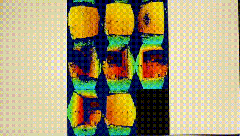

**160us delay — eliminating laser interference:**
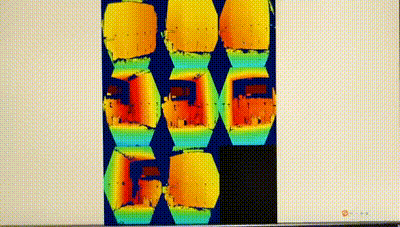


## 5 Operation Guide

### 5.1 Build the Project

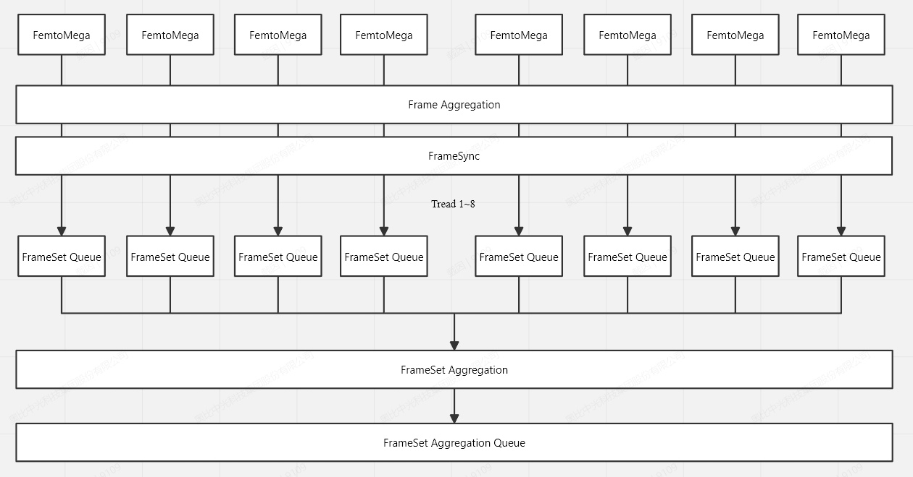

Clone or download the repository:

```bash
git clone https://github.com/orbbec/Multi-Device-Synchronization-Example.git
cd Multi-Device-Synchronization-Example
mkdir build
cd build
cmake ..
cmake --build . --config Release
```

### 5.2 Modify the Configuration File


Edit the configuration file to match your actual device serial numbers. Device serial numbers can be viewed using the OrbbecViewer tool or found in the program log after connecting the devices.


### 5.3 Run the Program

```bash
./MultiDeviceSync
```

## 6 Notes

### 6.1 Laser Interference

When multiple devices point in the same direction or have overlapping fields of view, their laser projectors may interfere with each other, resulting in visible noise or banding in depth images. Solutions:

- Configure staggered exposure via the `depthDelayUs` parameter, incrementing by 160us per device
- The minimum recommended delay is 160us (125us pulse width + 35us margin)
- Up to 8 devices can have interleaved exposure cycles

### 6.2 Flash Write Limit

When configuring sync mode, the program writes sync parameters to the device firmware. The sync configuration is retained after power-off, but frequent writes may affect Flash lifespan. It is recommended to:

- Avoid repeatedly writing the same configuration after initial setup
- Only execute the configuration operation (select `0`) when sync mode or parameters need to change
- For daily use, simply select `1` to start the data stream


### 6.3 Sync Hub Connection Cable

The cables connecting to the sync hub must use T568B-T568B standard Ethernet cables (RJ45 8-pin sync adapter cables).


### 6.4 Sync Hub Power Supply

The sync hub requires independent 5V Type-C power (Logic Level is set to 1.8V by default). Without power, the sync signal cannot be transmitted properly.


### 6.5 USB Bandwidth

When multiple USB devices simultaneously transmit high-resolution data streams, be mindful of USB bus bandwidth limitations:

- Use USB 3.0 or higher interfaces
- Avoid connecting multiple devices to the same USB controller


## 7 System Product List

| Item | Description |
| ---- | ---- |
| FemtoMega camera x8 | [Purchase link](https://store.orbbec.com/checkouts/cn/Z2NwLWFzaWEtc291dGhlYXN0MTowMUpCRTRIQ1E3WFZCR1QzSkJES0hCUU0zTQ) |
| 8P TO RJ45 adapter cable x8 | EF2103 multi-device sync adapter cable 8P TO RJ45 0.15m [Purchase link](https://store.orbbec.com/products/sync-adaptor-for-femto-mega-and-femto-bolt) |
| Ethernet multi-device sync Hub x8 | [Purchase link](https://store.orbbec.com/products/sync-hub-pro) |
| 5-port Gigabit PoE switch x4 | [Purchase recommendation](https://item.jd.com/10096782361958.html#crumb-wrap) |
| 5-meter RJ45 Ethernet cable x8 | T568B-T568B standard [Purchase recommendation](https://item.m.jd.com/product/100005267660.html) |
| Type-C Gigabit Ethernet adapter | Lenovo USB-C to RJ45 [Purchase recommendation](https://item.jd.com/100018111486.html#crumb-wrap) |
