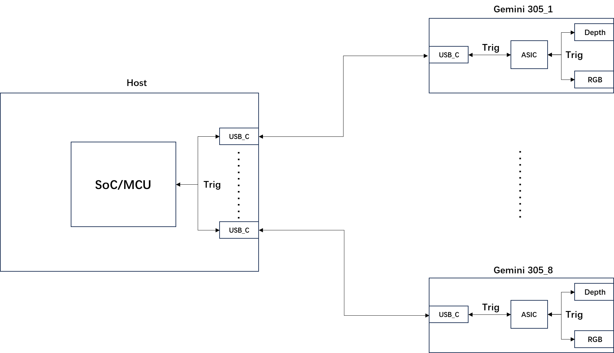
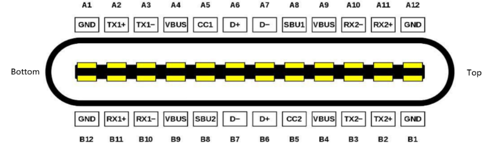
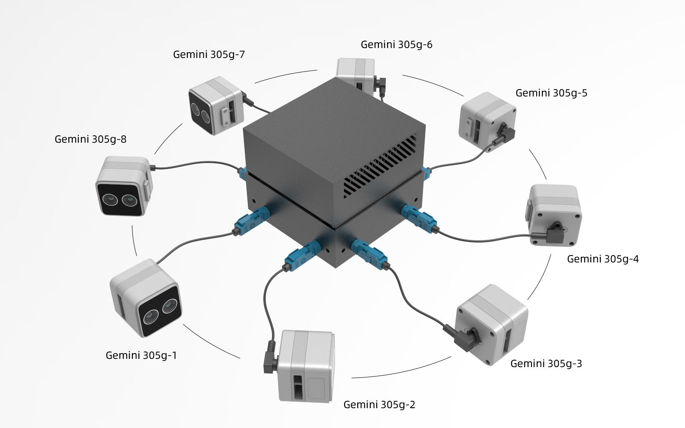
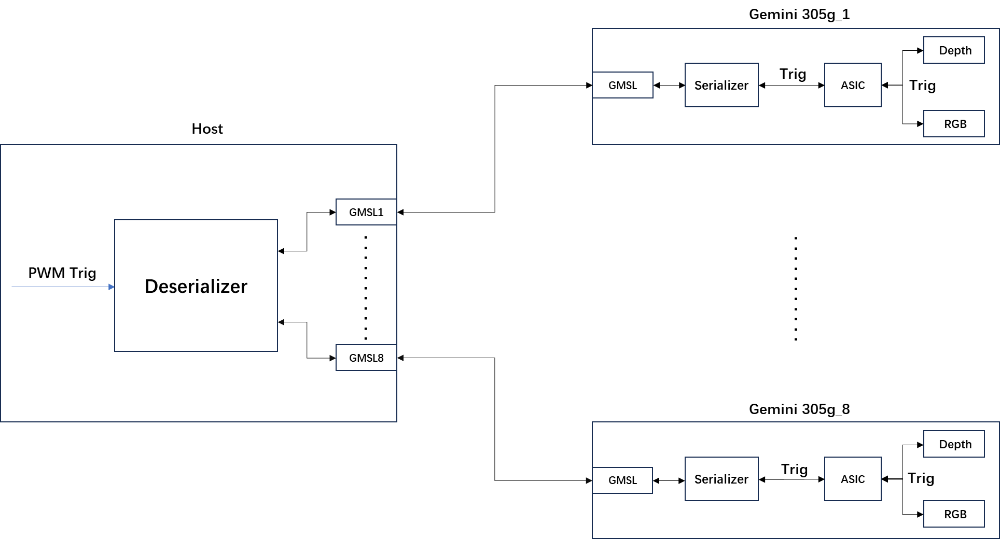
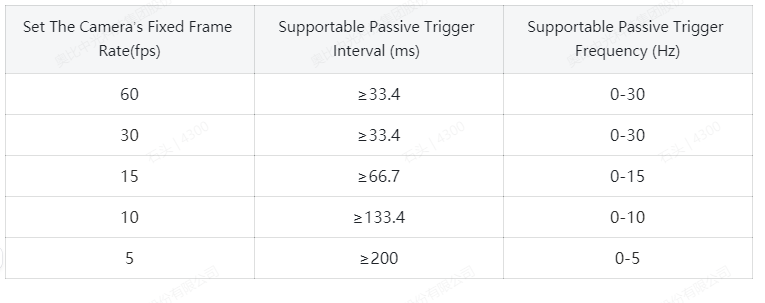
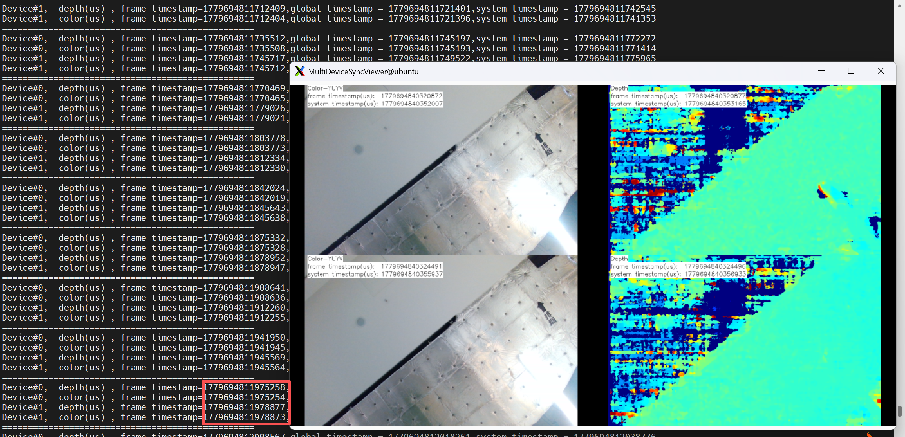
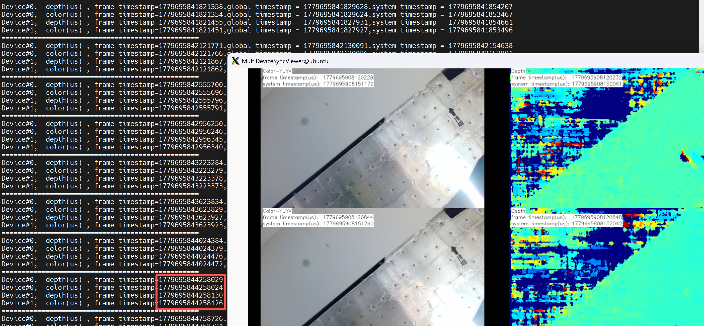
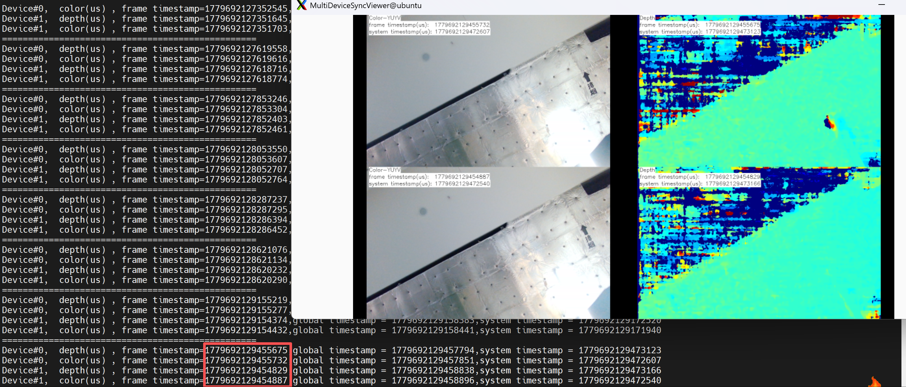

# Gemini 301 Series
For a multi-camera use case, one camera can be initialized as primary, and the rest
configured as secondary. Alternatively, an external signal generator can also be used as the primary trigger with all cameras set to secondary mode. 


## 1. Supported Devices

| Product| Support sync mode  | Notes  |
| -------- | ---- | ---- |
| **Gemini 305** | Primary, Secondary-synced, Software Triggering, Hardware Triggering |
| **Gemini 305g** | Secondary-synced, Hardware Triggering |


## 2. Hardware Connection

The Gemini 301 series supports two connection methods depending on the product model: USB connection and GMSL2 connection to NVIDIA embedded platforms (AGX Orin, Orin NX).

### 2.1 USB Connection

Gemini 305 and Gemini 305g support USB Connection.

- Gemini 305 Hardware Synchronization:



1. When designing system integration, please set Gemini 305 to “secondary_synced” mode, and simultaneously set the hardware synchronization signal to input.
2. The hardware sync signal is located on pins A8 and B8 of the USB Type C interface on Gemini 305, with a default voltage level of 1.8V. Additionally, a software interface is provided to set the voltage level to 3.3V and 5V.

3. During system integration design, the synchronization signal can be generated by SoC or MCU, and a star-type connection is adopted to connect the signal to the corresponding pins (A8, B8) of USB Type-C.

- Notes： USB connection requires modification of the USB cable harness. Please contact the FAE for assistance. 


### 2.2 GMSL2 Connect

- For the Gemini 305g, GMSL connection requires driver adaptation and installation first. The **driver path** is [MIPI Camera Platform Driver](https://github.com/orbbec/MIPI_Camera_Platform_Driver).


- GMSL2 devices can connect for multi-device sync through GMSL2/FAKRA.




- Gemini 305g Hardware Synchronization: 


There are two usage methods:

The first is to set all devices as **OB_MULTI_DEVICE_SYNC_MODE_SECONDARY_SYNCED** mode and synchronize them through PWM triggering. 

The second is to set all devices as **OB_MULTI_DEVICE_SYNC_MODE_HARDWARE_TRIGGERING** mode and synchronize them through PWM triggering. 


* Notes: To make the multi-device sync sample simple and versatile, the PWM trigger has been separated into the [MultiDeviceSyncGmslTrigger](../MultiDeviceSyncGmslTrigger/MultiDeviceSyncGmslTrigger.cpp) sample. GMSL2/FAKRA requires running two samples for testing. If you are developing your own application, you can combine these two functionalities into a single application.

## 3 Sync Modes

The Gemini 301 series supports four sync modes for different use cases.
- Notes: The Sync mode settings on the Gemini 301 Series are **not retained** after power cycling.

### 3.1 Primary/Secondary-synced Mode

The standard hardware cable sync mode. One device acts as the Primary outputting sync trigger signals, while the other devices act as Secondary receiving trigger signals, achieving frame exposure synchronization across all devices.

**Use case:** Multi-device synchronized capture via USB connection, using the standard 8-pin sync cable + sync hub solution.

**How it works:**

1. The Primary device sends a hardware trigger signal via the 8-pin sync cable at each frame exposure.
2. The sync hub distributes the signal to secondary devices.
3. Secondary devices perform exposure capture upon receiving the trigger signal.

**Startup sequence:**

1. Start all Secondary devices first (wait for initialization to complete).
2. Start the Primary device last.

**Configuration example (Primary):**

```json
{
    "sn": "CP2194200060",
    "syncConfig": {
        "syncMode": "OB_MULTI_DEVICE_SYNC_MODE_PRIMARY",
        "depthDelayUs": 0,
        "colorDelayUs": 0,
        "trigger2ImageDelayUs": 0,
        "triggerOutEnable": true,
        "triggerOutDelayUs": 0,
        "framesPerTrigger": 1
    }
}
```

**Configuration example (Secondary-synced):**

```json
{
    "sn": "CP0Y8420004K",
    "syncConfig": {
        "syncMode": "OB_MULTI_DEVICE_SYNC_MODE_SECONDARY_SYNCED",
        "depthDelayUs": 0,
        "colorDelayUs": 0,
        "trigger2ImageDelayUs": 0,
        "triggerOutEnable": true,
        "triggerOutDelayUs": 0,
        "framesPerTrigger": 1
    }
}
```


### 3.2 SOFTWARE_TRIGGERING Mode

PC-side software triggering mode. After all devices are configured in SOFTWARE_TRIGGERING mode, the PC sends a software command to trigger all devices to simultaneously capture one frame.

**Use case:** Scenarios without hardware sync cables, or where precise control of capture timing is needed (e.g., static object photography, quality inspection, etc.).

**How it works:**

1. All devices are configured in SOFTWARE_TRIGGERING mode
2. Devices enter a standby state, waiting for the PC to issue a trigger command
3. The user presses the `T` key in the preview window; the program calls `device->triggerCapture()` to trigger capture
4. All devices expose and capture simultaneously upon receiving the trigger command


**Configuration example:**

```json
{
    "sn": "CP2194200060",
    "syncConfig": {
        "syncMode": "OB_MULTI_DEVICE_SYNC_MODE_SOFTWARE_TRIGGERING",
        "depthDelayUs": 0,
        "colorDelayUs": 0,
        "trigger2ImageDelayUs": 0,
        "triggerOutEnable": true,
        "triggerOutDelayUs": 0,
        "framesPerTrigger": 1
    }
}
```


### 3.3 HARDWARE_TRIGGERING Mode

Hardware trigger mode. The device captures a specified number of frames upon receiving an external hardware trigger signal via the sync port.

**Use case:** Scenarios requiring precise control of capture timing via external hardware signals.

**How it works:**

1. The device is configured in HARDWARE_TRIGGERING mode
2. The device receives a hardware trigger signal via the sync port
3. Each trigger captures `framesPerTrigger` frames
4. The device simultaneously outputs a trigger signal via the sync port (enabled by default), which can be used to chain-trigger the next device

**Trigger frequency limit:**

To ensure proper operation in this mode, the IR, Depth, and RGB sensors must be configured to a common fixed frame rate (e.g., 5, 10, 15, 30, or 60 fps). This setting determines the minimum allowable time between two triggers and thus the maximum effective triggering frequency. The camera will only respond to trigger signals that fall within this permissible range. Consequently, any trigger frequency within the valid range can be passively supported.



**Configuration example:**

```json
{
    "sn": "CP2194200060",
    "syncConfig": {
        "syncMode": "OB_MULTI_DEVICE_SYNC_MODE_HARDWARE_TRIGGERING",
        "depthDelayUs": 0,
        "colorDelayUs": 0,
        "trigger2ImageDelayUs": 0,
        "triggerOutEnable": true,
        "triggerOutDelayUs": 0,
        "framesPerTrigger": 1
    }
}
```


### 3.4 syncConfig Field Reference

| Field  | Description |
| ---- | ---- |
| `syncMode` | Sync mode. Available values: `OB_MULTI_DEVICE_SYNC_MODE_PRIMARY`, `OB_MULTI_DEVICE_SYNC_MODE_SECONDARY_SYNCED`, `OB_MULTI_DEVICE_SYNC_MODE_SOFTWARE_TRIGGERING`, `OB_MULTI_DEVICE_SYNC_MODE_HARDWARE_TRIGGERING` |
| `depthDelayUs` | Configure depth trigger delay, unit: microseconds |
| `colorDelayUs` |  Color trigger signal input delay in microseconds. Typically set to 0 |
| `trigger2ImageDelayUs` |  Delay from trigger signal input to image capture in microseconds. Typically set to 0 |
| `triggerOutEnable` |  Device trigger signal output enable switch |
| `triggerOutDelayUs` | Device trigger signal output delay in microseconds. Typically set to 0 |
| `framesPerTrigger` | Number of frames captured per trigger. Only effective in SOFTWARE_TRIGGERING and HARDWARE_TRIGGERING modes, typically set to 1 |


## 4 Operation Guide

### 4.1 Build the Project

Open a terminal and navigate to the project directory:

```bash
cd Multi-Device-Synchronization-Example
mkdir build
cd build
cmake ..
cmake --build . --config Release
```

### 4.2 Modify the Configuration File


- Edit the `MultiDeviceSyncConfig.json` file to match your actual device `serial numbers`. Device serial numbers can be viewed using the OrbbecViewer tool or found in the program log after connecting the devices.
- Modify `syncMode` according to the actual synchronization mode.


### 4.3 Run Sample

- Notes: **This document only introduces multi device synchronization for the Gemini 305g**.

#### 4.3.1 All Device set to Secondary-synced 

- Modify the `sn` and `syncMode` fields in config/MultiDeviceSyncConfig.json

```
{
    "version": "1.0.1",
    "configTime": "2023/01/01",
    "devices": [
        {
            "sn": "CP2194200060",
            "syncConfig": {
                "syncMode": "OB_MULTI_DEVICE_SYNC_MODE_SECONDARY_SYNCED",
                "depthDelayUs": 0,
                "colorDelayUs": 0,
                "trigger2ImageDelayUs": 0,
                "triggerOutEnable": true,
                "triggerOutDelayUs": 0,
                "framesPerTrigger": 1
            }
        },
        {
            "sn": "CP0Y8420004K",
            "syncConfig": {
                "syncMode": "OB_MULTI_DEVICE_SYNC_MODE_SECONDARY_SYNCED",
                "depthDelayUs": 0,
                "colorDelayUs": 0,
                "trigger2ImageDelayUs": 0,
                "triggerOutEnable": true,
                "triggerOutDelayUs": 0,
                "framesPerTrigger": 1
            }
        }
    ]
}

```

- Set all devices **OB_MULTI_DEVICE_SYNC_MODE_SECONDARY_SYNCED** mode and synchronize them through PWM triggering. 

**1. Open the first terminal and run the multi-devices sync sample**

```
$ ./MultiDeviceSync

--------------------------------------------------
Please select options: 
 0 --> config devices sync mode. 
 1 --> start stream 
--------------------------------------------------
Please select input: 0
```

If no hardware trigger signal is provided, the synchronization accuracy between the two devices may deviate by approximately 3 ms.



**2. Open the second terminal and run the sample that sends PWM trigger signals with administrator privileges**

```
orbbec@agx:~/SensorSDK/build/install/Example/bin$ sudo ./MultiDeviceSyncGmslTrigger
Please select options: 
------------------------------------------------------------
 0 --> config GMSL SOC hardware trigger Source. Set trigger fps: 
 1 --> start Trigger 
 2 --> stop Trigger 
 3 --> exit 
------------------------------------------------------------
input select item: 0

Enter FPS (frames per second) (for example: 3000): 3000
Setting FPS to 3000...
Please select options: 
------------------------------------------------------------
 0 --> config GMSL SOC hardware trigger Source. Set trigger fps: 
 1 --> start Trigger 
 2 --> stop Trigger 
 3 --> exit 
------------------------------------------------------------
input select item: 1

```

**Notes:**

- Enter FPS (frames per second) (for example: 3000): 3000 (3000 indicates 30 fps).

 - OB_MULTI_DEVICE_SYNC_MODE_SECONDARY_SYNCED mode: Sets the device to secondary mode. In this mode, the PWM trigger frame rate must match the actual streaming frame rate. For example, if the streaming frame rate is 30 fps, the PWM frame rate must also be set to 30.

 - OB_MULTI_DEVICE_SYNC_MODE_HARDWARE_TRIGGERING mode: Sets the device to hardware triggering mode. 

 

**Test Results:**

 The multi-device synchronization results of two Gemini 305g on AGX Orin are as follows:

 
 


#### 4.3.2 All Device set to Hardware Triggering 
- Modify the `sn` and `syncMode` fields in config/MultiDeviceSyncConfig.json

```
{
    "version": "1.0.1",
    "configTime": "2023/01/01",
    "devices": [
        {
            "sn": "CP2194200060",
            "syncConfig": {
                "syncMode": "OB_MULTI_DEVICE_SYNC_MODE_HARDWARE_TRIGGERING",
                "depthDelayUs": 0,
                "colorDelayUs": 0,
                "trigger2ImageDelayUs": 0,
                "triggerOutEnable": true,
                "triggerOutDelayUs": 0,
                "framesPerTrigger": 1
            }
        },
        {
            "sn": "CP0Y8420004K",
            "syncConfig": {
                "syncMode": "OB_MULTI_DEVICE_SYNC_MODE_HARDWARE_TRIGGERING",
                "depthDelayUs": 0,
                "colorDelayUs": 0,
                "trigger2ImageDelayUs": 0,
                "triggerOutEnable": true,
                "triggerOutDelayUs": 0,
                "framesPerTrigger": 1
            }
        }
    ]
}

```

- Set all devices **OB_MULTI_DEVICE_SYNC_MODE_HARDWARE_TRIGGERING** mode and synchronize them through PWM triggering. 


**1. Open the first terminal and run the multi-devices sync sample**

```
$ ./MultiDeviceSync

--------------------------------------------------
Please select options: 
 0 --> config devices sync mode. 
 1 --> start stream 
--------------------------------------------------
Please select input: 0
```

**2. Open the second terminal and run the sample that sends PWM trigger signals with administrator privileges**

```
orbbec@agx:~/SensorSDK/build/install/Example/bin$ sudo ./MultiDeviceSyncGmslTrigger
Please select options: 
------------------------------------------------------------
 0 --> config GMSL SOC hardware trigger Source. Set trigger fps: 
 1 --> start Trigger 
 2 --> stop Trigger 
 3 --> exit 
------------------------------------------------------------
input select item: 0

Enter FPS (frames per second) (for example: 3000): 3000
Setting FPS to 3000...
Please select options: 
------------------------------------------------------------
 0 --> config GMSL SOC hardware trigger Source. Set trigger fps: 
 1 --> start Trigger 
 2 --> stop Trigger 
 3 --> exit 
------------------------------------------------------------
input select item: 1

```

**Notes:**

- Enter FPS (frames per second) (for example: 3000): 3000 (3000 indicates 30 fps).

 - OB_MULTI_DEVICE_SYNC_MODE_SECONDARY_SYNCED mode: Sets the device to secondary mode. In this mode, the PWM trigger frame rate must match the actual streaming frame rate. For example, if the streaming frame rate is 30 fps, the PWM frame rate must also be set to 30.

 - OB_MULTI_DEVICE_SYNC_MODE_HARDWARE_TRIGGERING mode: Sets the device to hardware triggering mode. 

 

**Test Results:**

 The multi-device synchronization results of two Gemini 305g on AGX Orin are as follows:

 
 


## Caution
- After starting the device, press 'ESC' in the image preview window to stop the data stream and exit the program. Abnormal program termination may cause incomplete shutdown of the device, leading to continuous triggering of the secondary device (restarting the device can resolve this).

- The same device can only be accessed by one application at a time. Opening the same device with multiple applications simultaneously may cause anomalies. Please use with caution.

- Using AE (Auto Exposure) may result in synchronization delays due to significant environmental differences between cameras. It is recommended to use the SDK to call exposure control interfaces and set fixed exposures to mitigate this issue.

- For Linux computers, such as Ubuntu, the default kernel allocates only 16 MB of memory for USB controllers to handle USB transfers. This amount may be insufficient for high-resolution images or multiple streams and devices. To support multiple devices, the USB controller must have more memory allocated. Follow these steps to increase the allocated memory:

```
echo 128 | sudo tee /sys/module/usbcore/parameters/usbfs_memory_mb
```
To make this change permanent:
Open the `/etc/default/grub` file, find and replace:
```
GRUB_CMDLINE_LINUX_DEFAULT="quiet splash"
```
with this
```
GRUB_CMDLINE_LINUX_DEFAULT="quiet splash usbcore.usbfs_memory_mb=128"
```

Update grub
```
sudo update-grub
```
Reboot and check
```
cat /sys/module/usbcore/parameters/usbfs_memory_mb
```