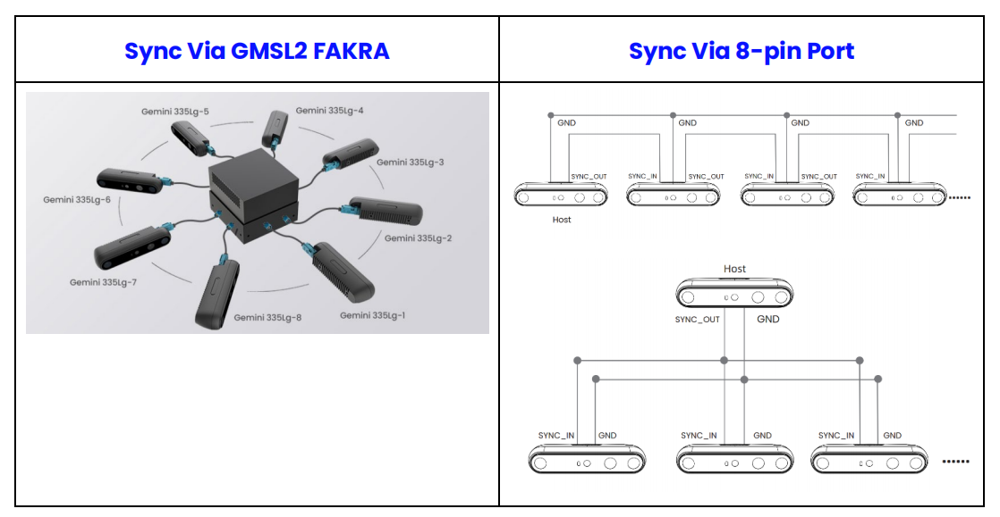
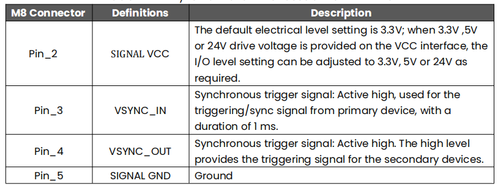
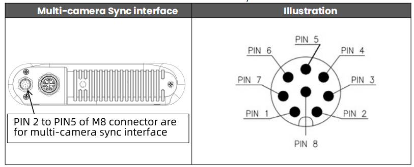
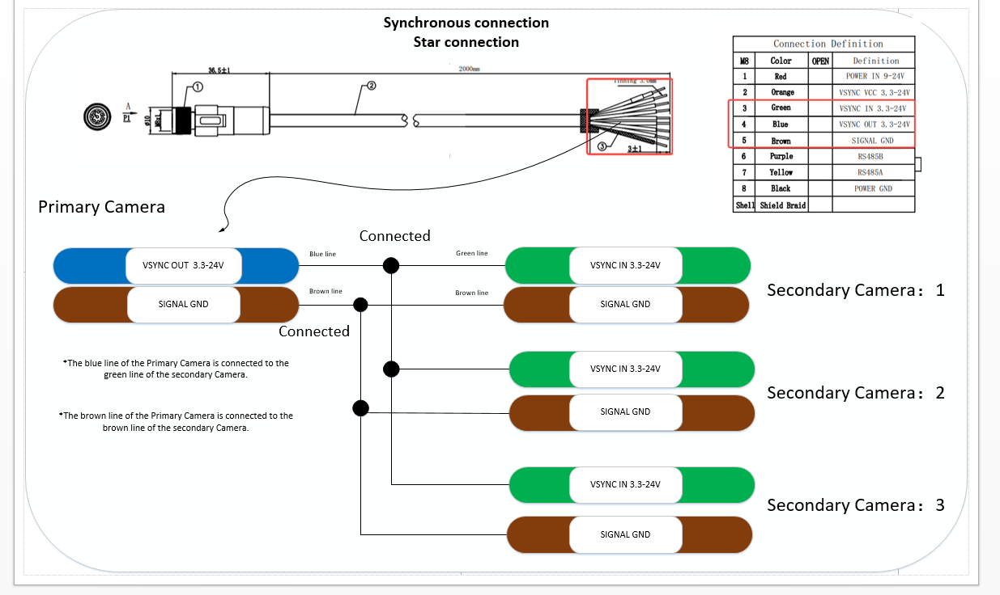
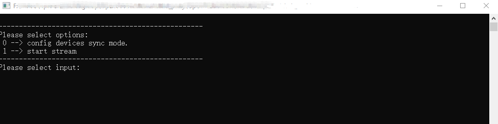
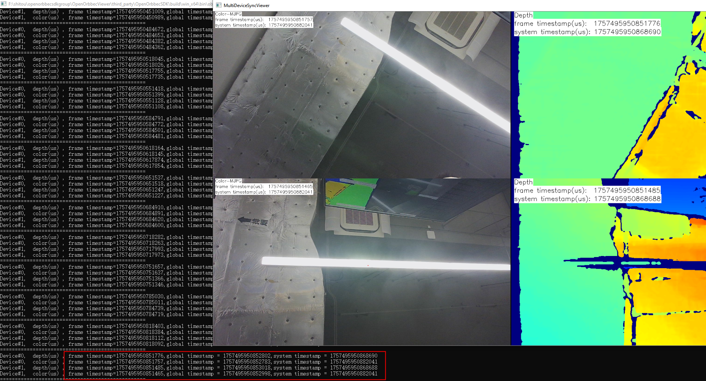
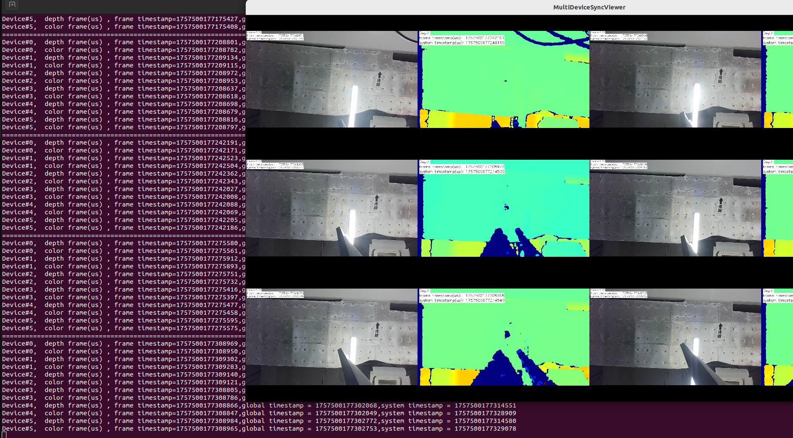

# Gemini 330 Series

For a multi-camera use case, one camera can be initialized as primary, and the rest
configured as secondary. Alternatively, an external signal generator can also be used as the primary trigger with all cameras set to secondary mode. 


## 1. Supported Devices

| Product Series | Product | Support sync mode |
| -------- | ---- | ---- |
| **Gemini 330 USB device** | Gemini 330, Gemini 335, Gemini 336, Gemini 330L, Gemini 335L, Gemini 336L |  Primary, Secondary-synced, Software Triggering, Hardware Triggering     |
| **Gemini 330 GMSL device** | Gemini 335Lg |   Secondary-synced,  Hardware Triggering     |
| **Gemini 330 Ethernet device** | Gemini 335Le |  Primary, Secondary-synced, Software Triggering, Hardware Triggering     |


## 2. Hardware Connection

The Gemini 330 series supports up to three connection methods depending on the product model: USB connection, GMSL2 connection to NVIDIA embedded platforms (AGX Orin, Orin NX), and Ethernet connection.

### 2.1 USB Connection

Gemini 330, Gemini 335, Gemini 336, Gemini 330L, Gemini 335L, Gemini 336L support USB Connection.

- USB devices must be connected to a sync hub (via the 8-pin port). Please refer to the [Multi-device Sync documentation](https://www.orbbec.com/docs-general/set-up-cameras-for-external-synchronization_v1-2/).


- When applying an external sync pulse, the HW SYNC input requires a 100-microsecond positive pulse at the nominal camera frame rate, e.g. 33.33 ms for a 30 Hz frame rate. Inputs are high impedance, **1.8V CMOS voltage levels**. However, it is important to make sure to use a high-resolution signal generator. The frequency of the signal generator needs to exactly match the sensor frame rate. For example, if the sensor is set up as 30 FPS, the
real frame rate may be 30.015 FPS. You may need to use an oscilloscope to measure the real frame rate and configure the signal generator to the same frequency. For this reason, it may be better to just use one additional camera as the primary sync signal generator.

### 2.2 GMSL2 Connect

- For the Gemini 335Lg, GMSL connection requires driver adaptation and installation first. The **driver path** is [MIPI Camera Platform Driver](https://github.com/orbbec/MIPI_Camera_Platform_Driver).


- GMSL2 devices can connect for multi-device sync via the 8-pin port or through GMSL2/FAKRA.




####  Method 1: Multi-device sync via 8-pin port
When using the 8-pin port for multi-device synchronization, in order to ensure the quality of the synchronization signal, it is necessary to use it together with a multi-device sync hub. Please refer to the [Multi-device Sync documentation](https://www.orbbec.com/docs-general/set-up-cameras-for-external-synchronization_v1-2/).

Via the 8-pin port, GMSL multi-device sync is the same as that for USB devices, and the supported synchronization modes are also the same. In the multi-device synchronization sample documentation, this synchronization method is not covered. Only the **Multi-device synchronization via GMSL2/FAKRA** method is introduced.


#### Method 2: Multi-device sync via GMSL2/FAKRA

For Gemini 335Lg hardware synchronization, please refer to [this document](https://www.orbbec.com/docs/gemini-335lg-hardware-synchronization/). There are two usage methods:

The first is to set all devices as **OB_MULTI_DEVICE_SYNC_MODE_SECONDARY_SYNCED** mode and synchronize them through PWM triggering. 

The second is to set all devices as **OB_MULTI_DEVICE_SYNC_MODE_HARDWARE_TRIGGERING** mode and synchronize them through PWM triggering. 


* Notes: To make the multi-device sync sample simple and versatile, the PWM trigger has been separated into the [MultiDeviceSyncGmslTrigger](../MultiDeviceSyncGmslTrigger/MultiDeviceSyncGmslTrigger.cpp) sample. GMSL2/FAKRA requires running two samples for testing. If you are developing your own application, you can combine these two functionalities into a single application.


### 2.3 Ethernet Connection

- The synchronization interfaces of Gemini 335Le are as follows:



- Gemini 335Le multi-camera synchronization pin placement:



- Use the synchronization signal in the power cable for synchronization connection. The detailed connection instructions are as follows:

1. Connect the power cable to the M8 interface of the camera.
2. Connect the Primary's Pin 4 (blue wire) VSYNC OUT 3.3–24V to the secondary device's Pin 3 (green wire) VSYNC IN 3.3–24V.
3. Connect the Primary's Pin 5 (brown wire) SIGNAL GND to the secondary device's Pin 5 (brown wire) SIGNAL GND.
4. For multiple secondary devices, use a star topology. All secondary devices should be connected to the host according to steps 2 and 3.

See the diagram below:


- When applying an external sync pulse, the HW SYNC input requires a 100-microsecond positive pulse at the nominal camera frame rate, e.g. 33.33 ms for a 30 Hz frame rate. Inputs are high impedance, **3.3V CMOS voltage levels**.


## 3 Sync Modes

The Gemini 330 series supports four sync modes for different use cases.
- Notes: The Sync mode settings on the Gemini 330 Series are **not retained** after power cycling.

### 3.1 Primary/Secondary-synced Mode

The standard hardware cable sync mode. One device acts as the Primary outputting sync trigger signals, while the other devices act as Secondary receiving trigger signals, achieving frame exposure synchronization across all devices.

**Use case:** Multi-device synchronized capture via USB connection, using the standard 8-pin sync cable + sync hub solution.

**How it works:**

1. The Primary device sends a hardware trigger signal via the 8-pin sync cable at each frame exposure.
2. The sync hub distributes the signal to secondary devices.
3. Secondary devices perform exposure capture upon receiving the trigger signal.

**Startup sequence:**

1. Start all Secondary devices first (wait for initialization to complete).
2. Start the Primary device last.

**Configuration example (Primary):**

```json
{
    "sn": "CP2194200060",
    "syncConfig": {
        "syncMode": "OB_MULTI_DEVICE_SYNC_MODE_PRIMARY",
        "depthDelayUs": 0,
        "colorDelayUs": 0,
        "trigger2ImageDelayUs": 0,
        "triggerOutEnable": true,
        "triggerOutDelayUs": 0,
        "framesPerTrigger": 1
    }
}
```

**Configuration example (Secondary-synced):**

```json
{
    "sn": "CP0Y8420004K",
    "syncConfig": {
        "syncMode": "OB_MULTI_DEVICE_SYNC_MODE_SECONDARY_SYNCED",
        "depthDelayUs": 0,
        "colorDelayUs": 0,
        "trigger2ImageDelayUs": 0,
        "triggerOutEnable": true,
        "triggerOutDelayUs": 0,
        "framesPerTrigger": 1
    }
}
```


### 3.2 SOFTWARE_TRIGGERING Mode

PC-side software triggering mode. After all devices are configured in SOFTWARE_TRIGGERING mode, the PC sends a software command to trigger all devices to simultaneously capture one frame.

**Use case:** Scenarios without hardware sync cables, or where precise control of capture timing is needed (e.g., static object photography, quality inspection, etc.).

**How it works:**

1. All devices are configured in SOFTWARE_TRIGGERING mode
2. Devices enter a standby state, waiting for the PC to issue a trigger command
3. The user presses the `T` key in the preview window; the program calls `device->triggerCapture()` to trigger capture
4. All devices expose and capture simultaneously upon receiving the trigger command

**Trigger frequency limit:**

Trigger frequency x `framesPerTrigger` must be less than the stream frame rate. For example, with a 30fps stream:

- `framesPerTrigger = 1`: manual trigger interval must be >= 33ms (approximately 30 triggers per second maximum)
- `framesPerTrigger = 5`: manual trigger interval must be >= 167ms (approximately 6 triggers per second maximum)

If triggering is too frequent, the device will not be able to process in time, which may result in frame drops or trigger failures.

**Configuration example:**

```json
{
    "sn": "CP2194200060",
    "syncConfig": {
        "syncMode": "OB_MULTI_DEVICE_SYNC_MODE_SOFTWARE_TRIGGERING",
        "depthDelayUs": 0,
        "colorDelayUs": 0,
        "trigger2ImageDelayUs": 0,
        "triggerOutEnable": true,
        "triggerOutDelayUs": 0,
        "framesPerTrigger": 1
    }
}
```


### 3.3 HARDWARE_TRIGGERING Mode

Hardware trigger mode. The device captures a specified number of frames upon receiving an external hardware trigger signal via the sync port.

**Use case:** Scenarios requiring precise control of capture timing via external hardware signals.

**How it works:**

1. The device is configured in HARDWARE_TRIGGERING mode
2. The device receives a hardware trigger signal via the sync port
3. Each trigger captures `framesPerTrigger` frames
4. The device simultaneously outputs a trigger signal via the sync port (enabled by default), which can be used to chain-trigger the next device

**Trigger frequency limit:**

| Trigger Method | Frequency Limit | Description |
| -------- | -------- | ---- |
| Device sync port trigger | Trigger frequency × framesPerTrigger < stream frame rate | e.g., 30fps stream, framesPerTrigger=1, maximum 30fps trigger |
| GMSL PWM trigger | PWM frame rate <= stream frame rate / 2 | e.g., 30fps stream allows maximum 15fps PWM, HARDWARE_TRIGGERING mode requires additional processing time |

If triggering is too frequent, the device will not be able to process in time, which may result in frame drops or trigger failures.

**Configuration example:**

```json
{
    "sn": "CP2194200060",
    "syncConfig": {
        "syncMode": "OB_MULTI_DEVICE_SYNC_MODE_HARDWARE_TRIGGERING",
        "depthDelayUs": 0,
        "colorDelayUs": 0,
        "trigger2ImageDelayUs": 0,
        "triggerOutEnable": true,
        "triggerOutDelayUs": 0,
        "framesPerTrigger": 1
    }
}
```

### 3.4 syncConfig Field Reference

| Field  | Description |
| ---- | ---- |
| `syncMode` | Sync mode. Available values: `OB_MULTI_DEVICE_SYNC_MODE_PRIMARY`, `OB_MULTI_DEVICE_SYNC_MODE_SECONDARY_SYNCED`, `OB_MULTI_DEVICE_SYNC_MODE_SOFTWARE_TRIGGERING`, `OB_MULTI_DEVICE_SYNC_MODE_HARDWARE_TRIGGERING` |
| `depthDelayUs` | Configure depth trigger delay, unit: microseconds |
| `colorDelayUs` |  Color trigger signal input delay in microseconds. Typically set to 0 |
| `trigger2ImageDelayUs` |  Delay from trigger signal input to image capture in microseconds. Typically set to 0 |
| `triggerOutEnable` |  Device trigger signal output enable switch |
| `triggerOutDelayUs` | Device trigger signal output delay in microseconds. Typically set to 0 |
| `framesPerTrigger` | Number of frames captured per trigger. Only effective in SOFTWARE_TRIGGERING and HARDWARE_TRIGGERING modes, typically set to 1 |


## 4 Operation Guide

### 4.1 Build the Project

Open a terminal and navigate to the project directory:

```bash
cd Multi-Device-Synchronization-Example
mkdir build
cd build
cmake ..
cmake --build . --config Release
```

### 4.2 Modify the Configuration File


Edit the configuration file to match your actual device serial numbers. Device serial numbers can be viewed using the OrbbecViewer tool or found in the program log after connecting the devices.


### 4.3 Run Sample

#### Windows
The following demonstrates how to use the multi-device synchronization sample on Windows with the Gemini 335L.
- Double-click MultiDeviceSync.exe. When the following dialog appears, select 0.




0: Configure sync mode and start stream

1: Start stream: If the parameters for multi-device sync mode have been configured, you can start the stream directly.


- Multi-device synchronization test results are as follows



Observe the timestamps. As shown in the figure below, the device timestamps of the two devices are identical, indicating that the two devices are successfully synchronized.

#### Linux/ARM64

- For USB device or Ethernet device multi-device synchronization, simply execute MultiDeviceSync. 
```
$ ./MultiDeviceSync
```
**Notes:**

**Multi-device sync via the 8-pin port: GMSL multi-device sync is the same as that for USB devices, and the supported synchronization modes are also the same.**


- For GMSL device multi-device sync via GMSL2/FAKRA, run the sample according to the following steps:

**1. Open the first terminal and run the multi-devices sync sample**

```
$ ./MultiDeviceSync

--------------------------------------------------
Please select options: 
 0 --> config devices sync mode. 
 1 --> start stream 
--------------------------------------------------
Please select input: 0
```


**2. Open the second terminal and run the sample that sends PWM trigger signals with administrator privileges**

```
orbbec@agx:~/SensorSDK/build/install/Example/bin$ sudo ./MultiDeviceSyncGmslTrigger
Please select options: 
------------------------------------------------------------
 0 --> config GMSL SOC hardware trigger Source. Set trigger fps: 
 1 --> start Trigger 
 2 --> stop Trigger 
 3 --> exit 
------------------------------------------------------------
input select item: 0

Enter FPS (frames per second) (for example: 3000): 3000
Setting FPS to 3000...
Please select options: 
------------------------------------------------------------
 0 --> config GMSL SOC hardware trigger Source. Set trigger fps: 
 1 --> start Trigger 
 2 --> stop Trigger 
 3 --> exit 
------------------------------------------------------------
input select item: 1

```

**Notes:**
- Enter FPS (frames per second) (for example: 3000): 3000 (3000 indicates 30 fps).

The differences between the two sync modes are as follows:

 - OB_MULTI_DEVICE_SYNC_MODE_SECONDARY_SYNCED mode: Sets the device to secondary mode. In this mode, the PWM trigger frame rate must match the actual streaming frame rate. For example, if the streaming frame rate is 30 fps, the PWM frame rate must also be set to 30.

 - OB_MULTI_DEVICE_SYNC_MODE_HARDWARE_TRIGGERING mode: Sets the device to hardware triggering mode. In this mode, the PWM trigger signal must not exceed half of the streaming frame rate. For example, if the streaming frame rate is set to 30 fps and the PWM trigger signal exceeds 15, the camera will still only capture images at 15 fps. In other words, when the streaming frame rate is 30 fps, the valid range for the PWM trigger signal is 1 to 15 fps.

 

#### Test Results
 The multi-device synchronization results of six Gemini 335Lg on AGX Orin are as follows:




## Caution
- After starting the device, press 'ESC' in the image preview window to stop the data stream and exit the program. Abnormal program termination may cause incomplete shutdown of the device, leading to continuous triggering of the secondary device (restarting the device can resolve this).

- The same device can only be accessed by one application at a time. Opening the same device with multiple applications simultaneously may cause anomalies. Please use with caution.

- Using AE (Auto Exposure) may result in synchronization delays due to significant environmental differences between cameras. It is recommended to use the SDK to call exposure control interfaces and set fixed exposures to mitigate this issue.

- For Linux computers, such as Ubuntu, the default kernel allocates only 16 MB of memory for USB controllers to handle USB transfers. This amount may be insufficient for high-resolution images or multiple streams and devices. To support multiple devices, the USB controller must have more memory allocated. Follow these steps to increase the allocated memory:

```
echo 128 | sudo tee /sys/module/usbcore/parameters/usbfs_memory_mb
```
To make this change permanent:
Open the `/etc/default/grub` file, find and replace:
```
GRUB_CMDLINE_LINUX_DEFAULT="quiet splash"
```
with this
```
GRUB_CMDLINE_LINUX_DEFAULT="quiet splash usbcore.usbfs_memory_mb=128"
```

Update grub
```
sudo update-grub
```
Reboot and check
```
cat /sys/module/usbcore/parameters/usbfs_memory_mb
```