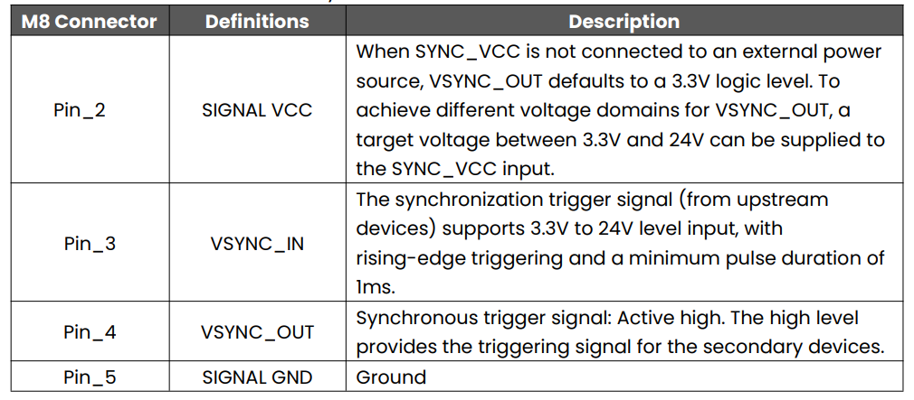
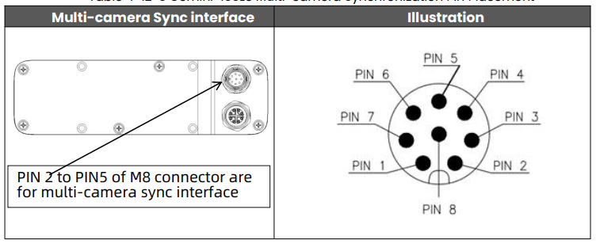

# Gemini 435Le

For a multi-camera use case, one camera can be initialized as primary, and the rest
configured as secondary. Alternatively, an external signal generator can also be used as the primary trigger with all cameras set to secondary mode. 


## 1. Supported Devices
| Product  |  Support sync mode |  
| -------- |  ---- | 
| Gemini 435Le  |  Primary, Secondary-synced, Software Triggering, Hardware Triggering    |           


## 2. Hardware Connection


- The synchronization interfaces of Gemini 435Le are as follows:




- Gemini 435Le multi-camera synchronization pin placement:



- Use the synchronization signal in the power cable for synchronization connection. The detailed connection instructions are as follows:

1. Connect the power cable to the M8 interface of the camera.
2. Connect the Primary's Pin 4 (blue wire) VSYNC OUT 3.3–24V to the secondary device's Pin 3 (green wire) VSYNC IN 3.3–24V.
3. Connect the Primary's Pin 5 (brown wire) SIGNAL GND to the secondary device's Pin 5 (brown wire) SIGNAL GND.
4. For multiple secondary devices, use a star topology. All secondary devices should be connected to the host according to steps 2 and 3.

See the diagram below:


- When applying an external sync pulse, the HW SYNC input requires a 100-microsecond positive pulse at the nominal camera frame rate, e.g. 33.33 ms for a 30 Hz frame rate. Inputs are high impedance, **3.3V CMOS voltage levels**.


## 3 Sync Modes

### 3.1 Primary/Secondary-synced Mode

The standard hardware cable sync mode. One device acts as the Primary outputting sync trigger signals, while the other devices act as Secondary receiving trigger signals, achieving frame exposure synchronization across all devices.

**How it works:**

1. The Primary device sends a hardware trigger signal via the 8-pin sync cable at each frame exposure.
2. The sync hub distributes the signal to secondary devices.
3. Secondary devices perform exposure capture upon receiving the trigger signal.

**Startup sequence:**

1. Start all Secondary devices first (wait for initialization to complete).
2. Start the Primary device last.

**Configuration example (Primary):**

```json
{
    "sn": "CP2194200060",
    "syncConfig": {
        "syncMode": "OB_MULTI_DEVICE_SYNC_MODE_PRIMARY",
        "depthDelayUs": 0,
        "colorDelayUs": 0,
        "trigger2ImageDelayUs": 0,
        "triggerOutEnable": true,
        "triggerOutDelayUs": 0,
        "framesPerTrigger": 1
    }
}
```

**Configuration example (Secondary-synced):**

```json
{
    "sn": "CP0Y8420004K",
    "syncConfig": {
        "syncMode": "OB_MULTI_DEVICE_SYNC_MODE_SECONDARY_SYNCED",
        "depthDelayUs": 0,
        "colorDelayUs": 0,
        "trigger2ImageDelayUs": 0,
        "triggerOutEnable": true,
        "triggerOutDelayUs": 0,
        "framesPerTrigger": 1
    }
}
```


### 3.2 SOFTWARE_TRIGGERING Mode

PC-side software triggering mode. After all devices are configured in SOFTWARE_TRIGGERING mode, the PC sends a software command to trigger all devices to simultaneously capture one frame.

**Use case:** Scenarios without hardware sync cables, or where precise control of capture timing is needed (e.g., static object photography, quality inspection, etc.).

**How it works:**

1. All devices are configured in SOFTWARE_TRIGGERING mode
2. Devices enter a standby state, waiting for the PC to issue a trigger command
3. The user presses the `T` key in the preview window; the program calls `device->triggerCapture()` to trigger capture
4. All devices expose and capture simultaneously upon receiving the trigger command

**Configuration example:**

```json
{
    "sn": "CP2194200060",
    "syncConfig": {
        "syncMode": "OB_MULTI_DEVICE_SYNC_MODE_SOFTWARE_TRIGGERING",
        "depthDelayUs": 0,
        "colorDelayUs": 0,
        "trigger2ImageDelayUs": 0,
        "triggerOutEnable": true,
        "triggerOutDelayUs": 0,
        "framesPerTrigger": 1
    }
}
```

**Trigger frequency limit:**

| Configured Camera Frame Rate (fps) | Supported Trigger Interval (ms) | Supported Output Frame Rate (fps) |
| ---------------------------------- | --------------------------------------- | ------------------------------------------------- |
| 20                                 | >=100                                   | 0–10                                              |
| 15                                 | >=133.4                                 | 0–7.5                                             |
| 10                                 | >=200                                   | 0–5                                               |
| 5                                  | >=400                                   | 0–2.5                                             |
  
Trigger Interval (us) > 1000000 / fps × (framesPerTrigger + 1) 

Where:

- fps is the configured frame rate.
- framesPerTrigger is the number of frames generated per trigger.

Actual output frame rate:

```
Fps = 1000000 / Trigger Interval × framesPerTrigger
```

This means the next trigger should start only after all frame outputs from the current trigger have been completed.

If triggering is too frequent, the device will not be able to process in time, which may result in frame drops or trigger failures.


### 3.3 HARDWARE_TRIGGERING Mode

Hardware trigger mode. The device captures a specified number of frames upon receiving an external hardware trigger signal via the sync port.

**Use case:** Scenarios requiring precise control of capture timing via external hardware signals.

**How it works:**

1. The device is configured in HARDWARE_TRIGGERING mode
2. The device receives a hardware trigger signal via the sync port
3. Each trigger captures `framesPerTrigger` frames
4. The device simultaneously outputs a trigger signal via the sync port (enabled by default), which can be used to chain-trigger the next device

**Configuration example:**

```json
{
    "sn": "CP2194200060",
    "syncConfig": {
        "syncMode": "OB_MULTI_DEVICE_SYNC_MODE_HARDWARE_TRIGGERING",
        "depthDelayUs": 0,
        "colorDelayUs": 0,
        "trigger2ImageDelayUs": 0,
        "triggerOutEnable": true,
        "triggerOutDelayUs": 0,
        "framesPerTrigger": 1
    }
}
```

**Trigger frequency limit:**

| Configured Camera Frame Rate (fps) | Supported Trigger Interval (ms) | Supported Output Frame Rate (fps) |
| ---------------------------------- | --------------------------------------- | ------------------------------------------------- |
| 20                                 | >=100                                   | 0–10                                              |
| 15                                 | >=133.4                                 | 0–7.5                                             |
| 10                                 | >=200                                   | 0–5                                               |
| 5                                  | >=400                                   | 0–2.5                                             |
  
Trigger Interval (us) > 1000000 / fps × (framesPerTrigger + 1) 

Where:

- fps is the configured frame rate.
- framesPerTrigger is the number of frames generated per trigger.

Actual output frame rate:

```
Fps = 1000000 / Trigger Interval × framesPerTrigger
```

This means the next trigger should start only after all frame outputs from the current trigger have been completed.

If triggering is too frequent, the device will not be able to process in time, which may result in frame drops or trigger failures.


### 3.4 syncConfig Field Reference

| Field  | Description |
| ---- | ---- |
| `syncMode` | Sync mode. Available values: `OB_MULTI_DEVICE_SYNC_MODE_PRIMARY`, `OB_MULTI_DEVICE_SYNC_MODE_SECONDARY_SYNCED`, `OB_MULTI_DEVICE_SYNC_MODE_SOFTWARE_TRIGGERING`, `OB_MULTI_DEVICE_SYNC_MODE_HARDWARE_TRIGGERING` |
| `depthDelayUs` | Configure depth trigger delay, unit: microseconds |
| `colorDelayUs` |  Color trigger signal input delay in microseconds. Typically set to 0 |
| `trigger2ImageDelayUs` |  Delay from trigger signal input to image capture in microseconds. Typically set to 0 |
| `triggerOutEnable` |  Device trigger signal output enable switch |
| `triggerOutDelayUs` | Device trigger signal output delay in microseconds. Typically set to 0 |
| `framesPerTrigger` | Number of frames captured per trigger. Only effective in SOFTWARE_TRIGGERING and HARDWARE_TRIGGERING modes, typically set to 1 |


## 4 Operation Guide

### 4.1 Build the Project

Open a terminal and navigate to the project directory:

```bash
cd Multi-Device-Synchronization-Example
mkdir build
cd build
cmake ..
cmake --build . --config Release
```

### 4.2 Modify the Configuration File


Edit the configuration file to match your actual device serial numbers. Device serial numbers can be viewed using the OrbbecViewer tool or found in the program log after connecting the devices.


### 4.3 Run Sample

#### Windows
The following demonstrates how to use the multi-device synchronization sample on Windows.
- Double-click MultiDeviceSync.exe. When the following dialog appears, select 0.


0: Configure sync mode and start stream

1: Start stream: If the parameters for multi-device sync mode have been configured, you can start the stream directly.


- Multi-device synchronization test results are as follows


Observe the timestamps. As shown in the figure below, the device timestamps of the two devices are identical, indicating that the two devices are successfully synchronized.

#### Linux/ARM64

```
$ ./MultiDeviceSync
```

## Caution
- After starting the device, press 'ESC' in the image preview window to stop the data stream and exit the program. Abnormal program termination may cause incomplete shutdown of the device, leading to continuous triggering of the secondary device (restarting the device can resolve this).

- The same device can only be accessed by one application at a time. Opening the same device with multiple applications simultaneously may cause anomalies. Please use with caution.

- Using AE (Auto Exposure) may result in synchronization delays due to significant environmental differences between cameras. It is recommended to use the SDK to call exposure control interfaces and set fixed exposures to mitigate this issue.
